# laba

## 
<b>МОДУЛЬ 1</b>

 Задание: 
 Необходимо разработать и настроить инфраструктуру информационно коммуникационной системы согласно предложенной топологии (см. Рисунок 1). Задание включает базовую настройку устройств: 
- присвоение имен устройствам, 
- расчет IP-адресации, 
- настройку коммутации и маршрутизации.

 В ходе проектирования и настройки сетевой инфраструктуры следует вести отчет о своих действиях, включая таблицы и схемы, предусмотренные в задании. Итоговый отчет должен содержать одну таблицу и пять отчетов о ходе работы. Итоговый отчет по окончании работы следует сохранить на диске рабочего места

  

  

<b>Чтобы зайти на стенд для 1 модуля.</b>

 

<b>User name: m1</b>

<b>Password: modul1</b>

Перед включением виртуалок Настроем вланы. По заданию HQ-SRV в 100 влане, а  HQ-CLI в 200
> **Примечание:**
> Основные сведения о настройке коммутатора и выбора реализации разделения на VLAN занесите в отчёт

  

  

  

  

**ISP преднастроена, но включать ее надо**

  

### 
<b>Сетевая связность - между HQ и BRANCH</b>

> **Примечание:**
> Сведения об адресах занесите в отчёт, в качестве примера используйте Таблицу 3

 
<b>*HQ-RTR*</b>

Задаём сразу FQDN - выбор имени домена произвольный:

  

По такой же аналогии настройте остальные имена

Чтобы настроить адресацию переходим:

  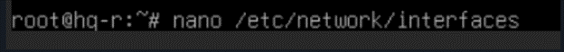

Заодно настроим GRE туннель

  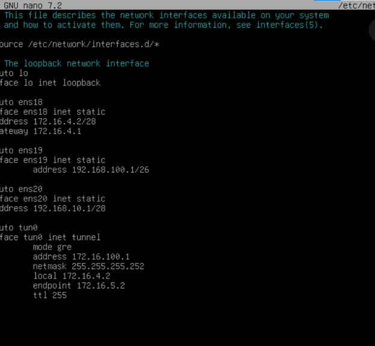

  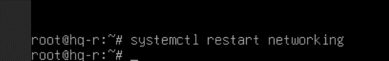

Включаем пересылку пакетов между портами (интерфейсами)

  

  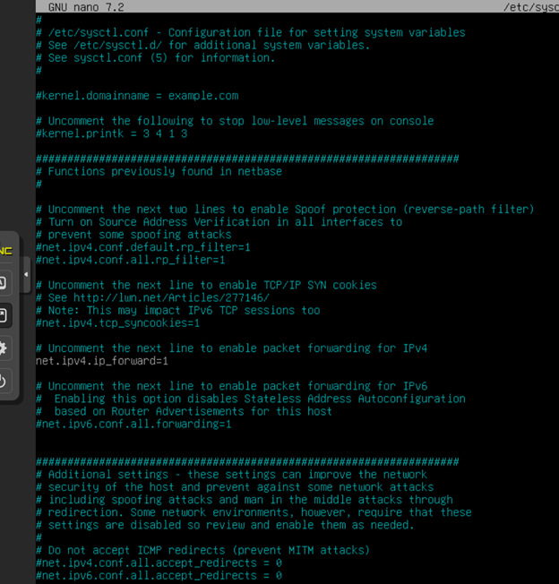

Применяем: 

***sysctl -p***

Прокинем PAT так, как по приколу тачки, что подключены к роутеру пинговать инет не будут.

  

  

Обязательно добавим в автозагрузку и активируем

  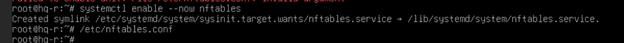

Туннель мы допустим подняли, но чтобы пакеты через него пошли, нужна маршрутизация.
> **Примечание:**
> Сведения о настройке и защите протокола(ospf) занесите в отчёт

Установим frr.

  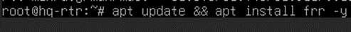

> **РЕКОМЕНДАЦИЯ:**
> ПОКА FRR СКАЧИВАЕТСЯ ПЕРЕХОДИМ К НАСТРОЙКЕ BR-RTR

В файле /etc/frr/daemons - включим поддержку OSPFv2 (IPv4)

  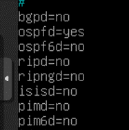

Не забываем перезапускать, чтобы изменения вступили в силу

  

Переходим к настройке frr (ospf)

  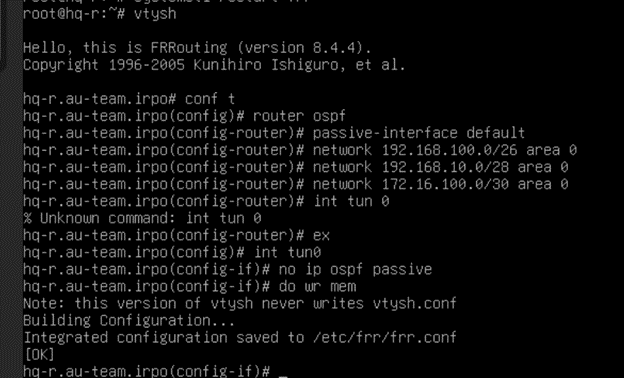

Поставим пароль на frr

  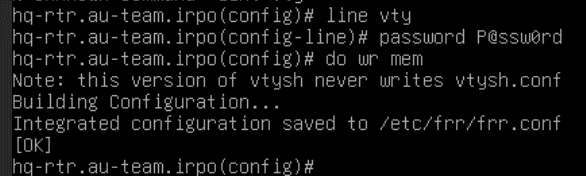

Не забываем перезапустить

  

И добавить в автозагрузку

  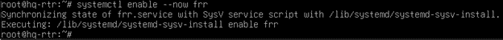

 
<b>*BR-RTR*</b>

Произведем те же манипуляции

  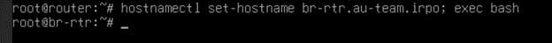

  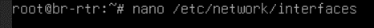

  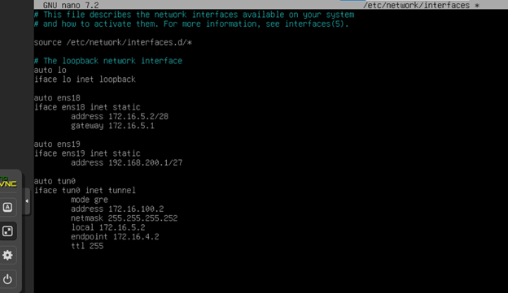

  

  

  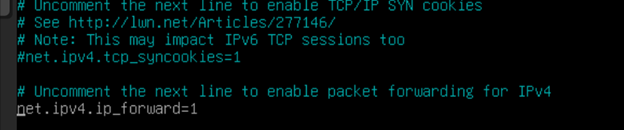

  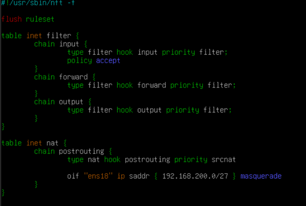

  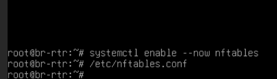

  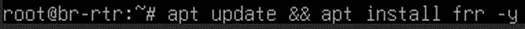

> **РЕКОМЕНДАЦИЯ:**
> ПОКА FRR СКАЧИВАЕТСЯ ДОДЕЛЫВАЕМ FRR НА HQ-RTR

  

  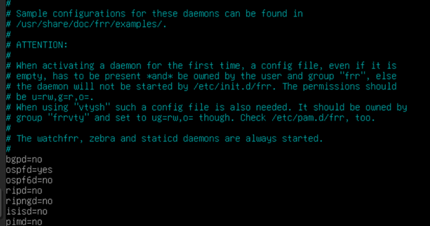

  

  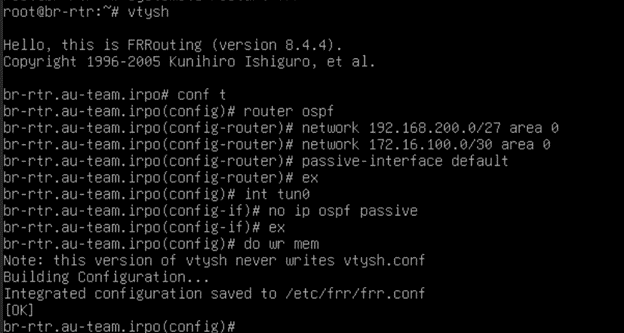

  

  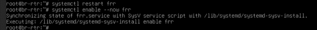

Ура сетевая связность у между hq и br настроена

Для проверки пингуем с br-rtr:

***ping 192.168.100.1***

> **РЕКОМЕНДАЦИЯ:**
> сразу на HQ-RTR скачаем: apt update && apt install –y isc-dhcp-server

<b>*HQ-SRV*</b>

Задаем имя:  

  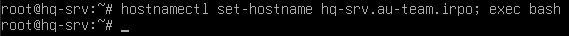

Прокинем инет:

  

Перезапускаем сервис:

***Systemctl restart networking***

Проверяем:

  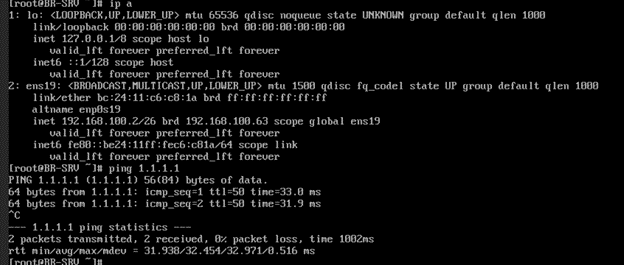

<b>*BR-SRV*</b>

  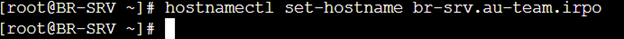

  

Перезапускаем сервис:

***Systemctl restart networking***

Проверяем:

  

> **РЕКОМЕНДАЦИЯ:**
> сразу скачиваем на HQ-SRV: apt update && apt install -y dnsmasq

### 
<b>Создание локальных учетных записей</b>

<b>Создайте пользователя sshuser на серверах</b>

<b>*HQ-SRV и BR-SRV*</b>

  

Пользователь sshuser должен иметь возможность запускать sudo без дополнительной аутентификации.

В дебиане нету судо поэтому скачаем:

  

  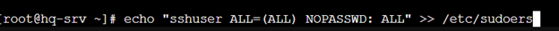

НА BR-SRV СДЕЛАЙТЕ ТОЖЕ САМОЕ

<b>Создайте пользователя net_admin на маршрутизаторах</b>

<b>*HQ-RTR и BR-RTR*</b>

  

  

В дебиане нет sudo поэтому скачаем

  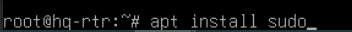

  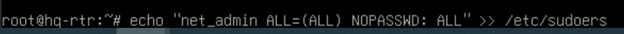

СДЕЛАЙТЕ ТОЖЕ САМОЕ НА BR-RTR

### 
<b>Настройка безопасного удаленного доступа на серверах HQ-SRV и BR-SRV:</b>

- Для подключения используйте порт 2024 
- Разрешите подключения только пользователю sshuser ● Ограничьте количество попыток входа до двух 
- Настройте баннер «Authorized access only»

<b>*HQ-SRV и BR-SRV*</b>

  

Редактируем файл /etc/ssh/sshd_config:

  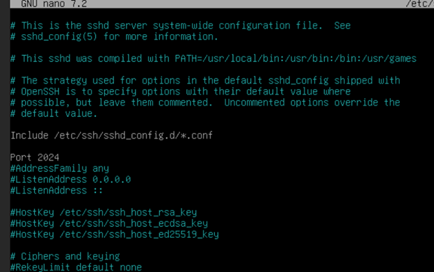

  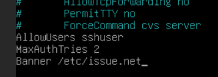

  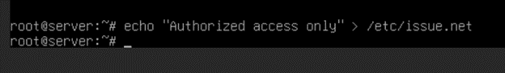

  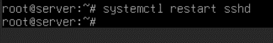

ДУБЛИРУЕМ ТОЖЕ САМОЕ НА BR-SRV

### 
<b>Установим и настроим DHCP-сервер</b>

и зарезервируем адрес для HQ-SRV, чтобы потом на всех остальных оконечных устройствах задавая адреса сразу создавать пользователей

<b>*HQ-RTR:*</b>

Скачаем: ***apt install –y isc-dhcp-server***

Первым делом нам необходимо указать, что наш DHCP сервер должен принимать запросы только с ens20 интерфейса.

  

  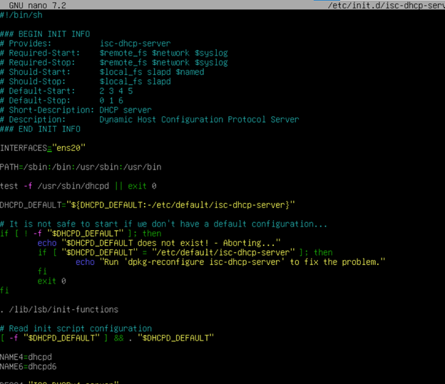

Настройка протокола динамической конфигурации хостов. 

- Настройте нужную подсеть 
- Для офиса HQ в качестве сервера DHCP выступает маршрутизатор HQ-RTR. 
- Клиентом является машина HQ-CLI. 
- Исключите из выдачи адрес маршрутизатора 
- Адрес шлюза по умолчанию – адрес маршрутизатора HQ-RTR. 
- Адрес DNS-сервера для машины HQ-CLI – адрес сервера HQ-SRV. 
- DNS-суффикс для офисов HQ – au-team.irpo 
- Сведения о настройке протокола занесите в отчёт

  

  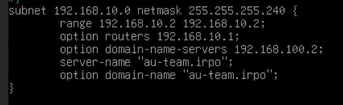

  

> **Примечание:**
> Сведения о настройке протокола занесите в отчёт

### 
<b>Настройка DNS для офисов HQ и BR.</b>

- Основной DNS-сервер реализован на HQ-SRV. 
- Сервер должен обеспечивать разрешение имён в сетевые адреса устройств и обратно в соответствии с таблицей 2 
- В качестве DNS сервера пересылки используйте любой общедоступный DNS сервер

Нам необходимо настроить DNS сервер. Будем использовать dnsmasq.

<b>*HQ-SRV*</b>

  

  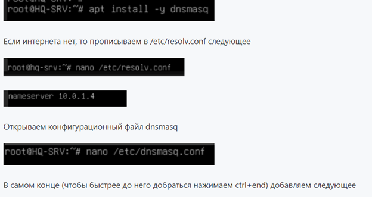

  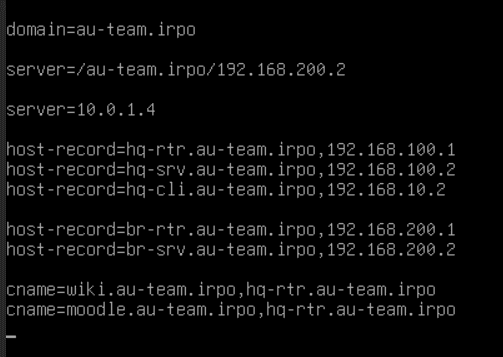

Теперь открываем скрипт-инициализации сервиса dnsmasq

  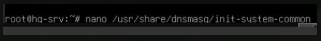

ищем строчку DNSMASQ_OPTS

  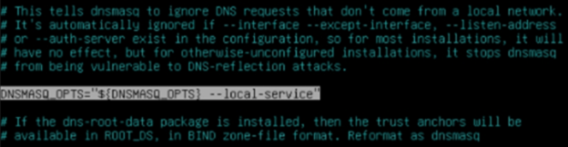

Убираем оттуда –local-service

  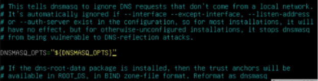

Перезагружаем службу dnsmasq:

***systemctl restart dnsmasq***

После настройки dns-сервера прописываем всем машинам в /etc/resolv.conf:

***nameserver 192.168.100.2***

  

### 
<b>Настройте часовой пояс на всех устройствах, согласно месту проведения экзамена.</b>

<b>*HQ-SRV, HQ-CLI, BR-SRV*</b>

Проверяем какой часовой пояс установлен:

***timedatectl status***

  

Если отличается, то устанавливаем:

***timedatectl set-timezone Asia/Yekaterinburg***

## 
<b>МОДУЛЬ 2</b>

<b>Чтобы зайти на стенд для 2-3 модуля.</b>

 

<b>User name: m2</b>

<b>Password: modul2</b>

### 
<b>1. Настройте доменный контроллер Samba на машине BR-SRV.</b>

**
<b>(СДЕЛАТЬ СРАЗУ 3 СНАПШОТА НА BR-SRV(samba), HQ-CLI(Active Directory), HQ-SRV(mdadm))</b>
**

- Создайте 5 пользователей для офиса HQ: имена пользователей формата user№.hq. Создайте группу hq, введите в эту группу созданных пользователей 
- Введите в домен машину HQ-CLI 
- Пользователи группы hq имеют право аутентифицироваться на клиентском ПК 
- Пользователи группы hq должны иметь возможность повышать привилегии для выполнения ограниченного набора команд: cat, grep, id. Запускать другие команды с повышенными привилегиями пользователи группы не имеют права 
- Выполните импорт пользователей из файла users.csv. Файл будет располагаться на виртуальной машине BR-SRV в папке /opt

<b>*BR-SRV*</b>

> **Обязательно:**
> Временно заменяем в /etc/resolv.conf 192.168.100.2 на  10.0.1.4, чтобы samba быстрее скачивалось

Переходим к настройкам самого контроллера домена на BR-SRV

  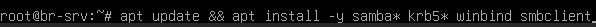

> **РЕКОМЕНДАЦИЯ:**
> НА CLI: apt-get update && apt-get remove -y alterator-datetime && apt-get install -y task-auth-ad-sssd && apt-get install -y admc  
> НА CLI: apt-get install -y openssh-server && systemctl restart sshd.  
> НА HQ-SRV: apt update && apt install mdadm -y

Появится синее окно, не пугайтесь, так и должно быть. В первом окне вводим имя домена au-team.irpo, а во втором — имя нашего сервера hq-srv

Удаляем докер:

***apt remove docker.io -y && ip link delete docker0;***

- Проверяем что установлено имя в формате FQDN;  
- Задаём domainname;  
- Очищаем конфигурацию samba;  
- Разворачиваем контроллер домена Active Directory на базе SambaDC с Dnsmasq в качестве DNS

  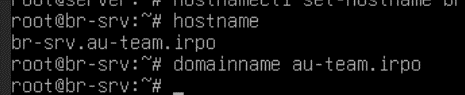

  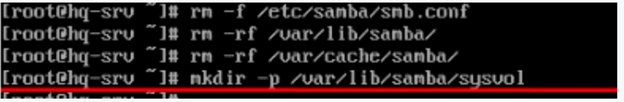

Подготовка домена: Samba-tool --realm=au-team.irpo --domain=au-team –adminpass=”PAssw0rd” --dnsbackend=SAMBA_INTERNAL --option=”dns forwrder=192.168.100.2” --server-role=dc

ВЫ МОЖЕТЕ НАПИСАТЬ ТОЛЬКО «Samba-tool domain provision», А ОСТАЛЬНОЕ ОНО СПРОСИТ САМО

  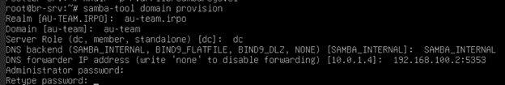

Как видим че то не так, надо перезапустить машинку:

***reboot***

Вводим все заново  
Проверяем:

  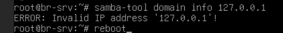

Ничего не показывает, надо перезапустить машину, снова проверяем:

  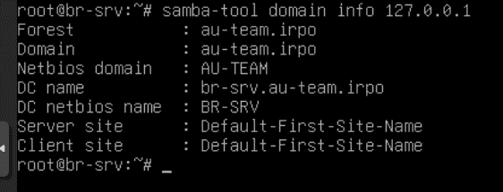

> **Обязательно:**
> ВВОДИМ МАШИНУ обратно В ДОМЕН:  
> nano /etc/resolv.conf – nameserver 192.168.100.2

> **РЕКОМЕНДАЦИЯ:**
> НА BR-SRV здесь же скачиваем: apt install ansible -y  
> НА HQ-SRV скачиваем: apt install nfs-kernel-server -y

<b>На клиента ставим необходимые пакеты</b>

**
<b>(СДЕЛАТЬ,если не сделали, НА HQ-CLI SNAPSHOT)</b>
**

<b>*CLI*</b>

При установке пакета task-auth-ad-sssd у вас возникнет ошибка, связанная с конфликтом с пакетом alterator-datetime, его необходимо удалить:

***apt-get update && apt-get remove -y alterator-datetime***

После пропишем инсталл:

***apt-get install -y task-auth-ad-sssd***

Переходим к редактированию временного соединения и в качестве DNS-сервера прописываем адрес HQ-SRV, а также указываем поисковый домен:

  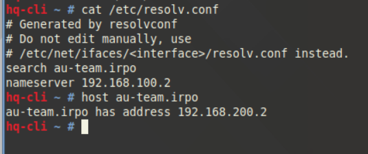

Переходим в Центр управления системой, на вкладке Пользователи выбираем Аутентификация

  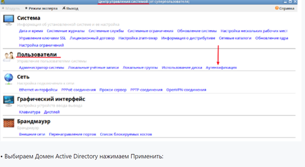

  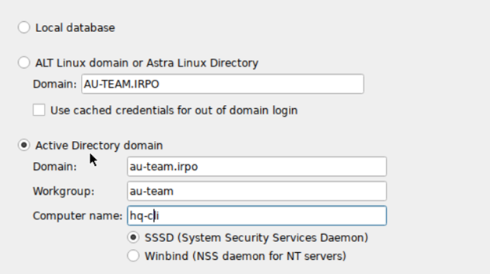

  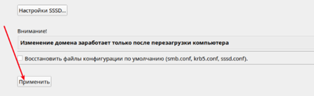

Вводим пароль администратора домена:

  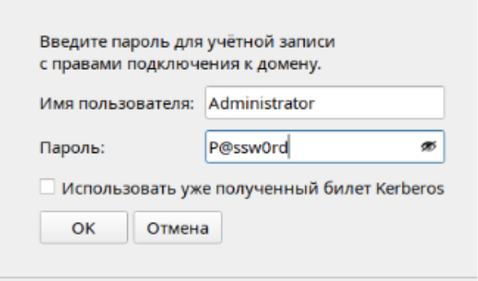

Нажимаем ОК и перезагружаем систему:

  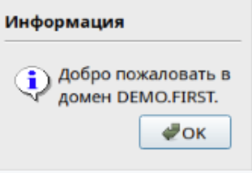

> **РЕКОМЕНДАЦИЯ:** 
> НА BR-SRV скачиваем: apt install -y docker.io docker-compose  
> НА HQ-SRV скачиваем: apt install -y apache* -y && apt install -y php php8.2 php-curl php-zip php-xml libapache2-mod-php php-mysql php-mbstring php-gd php-intl php-soap -y

В качестве проверки после перезагрузки можно выполнить аутентификацию от имени доменного пользователя Administrator:

  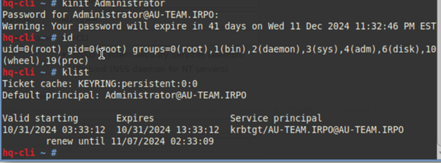

Организуем отслеживание подключения к домену: CLI: На клиенте с граф. интерфейсом установим Модуль удаленного управления базой данных конфигурации (ADMC) • Установим пакет admc:

***apt-get install -y admc***

Для использования ADMC необходимо предварительно получить ключ Kerberos для администратора домена. Получить ключ Kerberos можно, например, выполнив следующую команду, из под обычного пользователя:

***kinit Administrator***

ADMC запускается из меню запуска приложений: пункт «Системные» → ADMC или из командной строки (команда admc).

_____________________________________________________________________________________

Если admc долго не может запуститься(не выдает ошибок, но не запускается), то внесите изменения в файл /etc/krb5.conf

  

_____________________________________________________________________________________

На вкладке «Компьютеры» в графическом режиме удобно отслеживать подключение к домену.

Создаем пять юзеров:

  

  

<b>Создаем группу hq и в нее добавляем раннее созданных пользователей</b>

Пользователи группы hq должны иметь возможность повышать привилегии для выполнения ограниченного набора команд: cat, grep, id. Запускать другие команды с повышенными привилегиями пользователи группы не имеют права

<b>*CLI*</b>

Настройте файл */etc/sudoers* на рабочей станции Linux, как описано в предыдущем ответе, используя синтаксис для доменных групп:  

***%hq ALL=(ALL) NOPASSWD: /bin/cat, /bin/grep, /usr/bin/id***

<b>Выполните импорт пользователей из файла users.csv. Файл будет располагаться на виртуальной машине BR-SRV в папке /opt</b>

- Сначала скачаем необходимую утилиту на BR-SRV:

***apt install dos2unix -y***

- Потом на BR-SRV скачиваем скрипт, который выполнит за нас задание:

***cd /opt***

***curl -O https://raw.githubusercontent.com/4bobus/laba/refs/heads/main/files/import_users.sh***

***ls /opt***

***dos2unix ~/import_users***

  

- Проверяем наличие скрипта:

***nano /opt/import_users.sh***

  

- Делаем файл исполняемым и выполняем его:

***chmod +x /opt/import__users.sh***

***/opt/import_users.sh***

> **РЕКОМЕНДАЦИЯ:**
> НА BR-SRV скачиваем: apt install –y mariadb-*  

### 
<b>2. Сконфигурируйте файловое хранилище</b>

<b>(СДЕЛАТЬ SNAPSHOT, если не сделали, на HQ-SRV)</b>

- При помощи трёх дополнительных дисков, размером 1Гб каждый, на HQ-SRV сконфигурируйте дисковый массив уровня 5 
- Имя устройства – md0, конфигурация массива размещается в файле /etc/mdadm.conf 
- Обеспечьте автоматическое монтирование в папку /raid5 
- Создайте раздел, отформатируйте раздел, в качестве файловой системы используйте ext4 
- Настройте сервер сетевой файловой системы(nfs), в качестве папки общего доступа выберите /raid5/nfs, доступ для чтения и записи для всей сети в сторону HQ-CLI 
- На HQ-CLI настройте автомонтирование в папку /mnt/nfs
- Основные параметры сервера отметьте в отчёте

Подготовка дисков

<b>*HQ-SRV*</b>

Убедитесь, что дополнительные диски распознаны системой. Список подключенных дисков можно проверить командой:

  

Создайте RAID 5 массив из трех 1Гб дисков (предположим, они определены как /dev/sdb, /dev/sdc, и /dev/sdd):

Скачаем службу mdadm:

  

  

Проверяем:

  

Проверьте статус RAID массива:

  

Сохраните конфигурацию массива в файл /etc/mdadm.conf:

  

1. Создание файловой системы и настройка монтирования

Создайте раздел и отформатируйте его в ext4:

  

Создайте точку монтирования и настройте автоматическое монтирование в /etc/fstab:

  

Смонтируйте файловую систему:

  

2. Настройка NFS-сервера на HQ-SRV

Установите NFS-сервер (если он еще не установлен):

  

Создайте директорию для общего доступа:

  

Настройте права доступа для общей папки:

  

Настройте экспорт NFS для всей сети с разрешением на чтение и запись.  
Откройте файл /etc/exports и добавьте строку:

  

Примените изменения в конфигурации NFS:

  

Перезапустите NFS-сервер:

  

> **ПРИМЕЧАНИЕ**
> Основные параметры сервера отметьте в отчёте

3. Настройка автомонтирования на HQ-CLI (под ALT Workstation)

<b>*HQ-CLI*</b>

Создайте точку монтирования:

  

Настройте автомонтирование в /etc/fstab, откройте этот файл и добавьте следующую строку:

  

Смонтируйте папку вручную (или перезагрузите систему для применения настроек):

  

Проверка подключения NFS на HQ-CLI: 

  

> **РЕКОМЕНДАЦИЯ:**
> НА HQ-SRV скачиваем: apt install -y mariadb-* -y

### 
<b>3. Настройте службу сетевого времени на базе сервиса chrony</b>

- В качестве сервера выступает HQ-RTR 
- На HQ-RTR настройте сервер chrony, выберите стратум 5
- В качестве клиентов настройте HQ-SRV, HQ-CLI, BR-RTR, BR-SRV

1. Настройка NTP сервера:

<b>*HQ-RTR*</b>

Установим пакет chrony на каждой машине:

***apt install -y chrony*** 

Приводим конфигурационный файл "chrony.conf" к следующему виду:

***nano /etc/chrony/chrony.conf***

  

> где:
> - server 127.0.0.1 iburst prefer - указываем сервером синхронизации самого себя, опция «iburst» принудительно отправляет сразу несколько пакетов для точности синхронизации,  
> - hwtimestamp * - опция, чтобы сетевой интерфейс считал собственный источник времени верным и синхронизировал клиентов с ним;  
> - local stratum 5 - устанавливаем для себя значение по stratum = 5;  
> - allow - кому разрешается подключаться к серверу и запрашивать время: чтобы не перечеслять все используемые в задании IPv4 и IPv6 сети, используется 0/0 и ::/0;  

Запускаем и добавляем в автозагрузку службу chronyd, и не забываем рестартать сервис:

***systemctl enable --now chrony***  
***systemctl restart chrony***

  

Проверяем:

  

2. Настройка NTP клиентов:

<b>*HQ-SRV, BR-SRV, BR-RTR, HQ-CLI*</b>

Установим пакет chrony:

***apt install -y chrony***

Приводим конфигурационный файл "chrony.conf" к следующему виду:

***nano /etc/chrony/chrony.conf***

  

> где: 192.168.100.1 - IPv4 адрес HQ-R;

Запускаем и добавляем в автозагрузку службу chronyd:

systemctl enable --now chrony 
> на cli chronyd

systemctl restart chrony
> на cli chronyd

Проверяем с клиента HQ-SRV:

  

Проверяем с сервера HQ-R:

  

BR-R | BR-SRV | CLI: Настройка аналогична HQ-SRV - за исключением указания соответствующих адресов

> **РЕКОМЕНДАЦИЯ:**
> НА HQ-SRV скачиваем: apt install -y git  
> НА HQ-RTR скачиваем: apt install nginx -y

### 
<b>4. Сконфигурируйте ansible на сервере BR-SRV</b>

<b>(СДЕЛАЙ SNAPSHOT НА BR-SRV)</b>

- Сформируйте файл инвентаря, в инвентарь должны входить HQSRV, HQ-CLI, HQ-RTR и BR-RTR 
- Рабочий каталог ansible должен располагаться в /etc/ansible 
- Все указанные машины должны без предупреждений и ошибок отвечать pong на команду ping в ansible посланную с BR-SRV

<b>*BR-SRV*</b>

1. Установите Ansible (если он еще не установлен):

***apt update && apt install ansible -y***

2. Создание рабочего каталога Ansible

Ansible обычно уже использует /etc/ansible как рабочий каталог, но если его нет, создайте его вручную:

  

3. Создание файла инвентаря

Создайте инвентарь файла : /etc/ansible/hosts. Открываем файл /etc/ansible/hosts

- Скачиваем файл с github:

***apt install dos2unix -y***

***apt install curl -y***

***cd /etc/ansible***

***curl -O https://raw.githubusercontent.com/4bobus/laba/refs/heads/main/files/hosts.file***

***dos2unix /etc/ansible/hosts.file***

- Проверяем его наличие:

  

  

4. Настройка SSH-доступа к машинам

Для того чтобы Ansible мог управлять машинами без необходимости ввода пароля, настройте SSH-доступ:

  

______________________________________________________________________________________

<b>(ДОПОЛНЕНИЕ)</b>

<b>*HQ-CLI*</b>

Для hq-cli нужно установить ssh службу: ***apt-get install -y openssh-server***

Перезагружаем ssh на hq-cli: ***systemctl restart sshd***

Для того чтобы зайти в конфиг ssh на альт линукс(cli) нужно ввести команду:
***nano /etc/openssh/sshd_config***

______________________________________________________________________________________

Скопируйте SSH-ключ на всех машинах в инвентаре : Выполните эту команду для каждой машины, чтобы разрешить безпарольный доступ:

  

  

  

  

5. Проверка подключения в Ansible

Выполните команду "ansible all -m ping" для проверки соединения со всеми хостами из инвентаря файла:

  

> **РЕКОМЕНДАЦИЯ:**
> НА HQ-SRV скачиваем: git clone git://git.moodle.org/moodle.git

### 
<b>5. Развертывание приложений в Docker на сервере BR-SRV.</b>

- Создайте в домашней директории пользователя файл wiki.yml для приложения MediaWiki. 
- Средствами docker compose должен создаваться стек контейнеров с приложением MediaWiki и базой данных. 
- Используйте два сервиса 
- Основной контейнер MediaWiki должен называться wiki и использовать образ mediawiki 
- Файл LocalSettings.php с корректными настройками должен находиться в домашней папке пользователя и автоматически монтироваться в образ. 
- Контейнер с базой данных должен называться mariadb и использовать образ mariadb (субд).
- Разверните 
- Он должен создавать базу с названием mediawiki, доступную по стандартному порту, пользователя wiki с паролем WikiP@ssw0rd должен иметь права доступа к этой базе данных 
- MediaWiki должна быть доступна извне через порт 8080.

<b>*BR-SRV*</b>

1. Скачиваем докер:

***apt install -y docker.io docker-compose***

2. Включаем и добавляем в автозагрузку службу docker:

***systemctl enable --now docker.service***

3. В домашней директории пользователя root создаём файл wiki.yml со следующим содержимым:

- Чтобы вручную файл не заполнять просто скачиваем его с github:
> !dos2unix и curl на BR-SRV уже скачаны!

***cd ~/***

***curl -O https://raw.githubusercontent.com/4bobus/laba/main/files/wiki.yml***

***dos2unix ~/wiki.yml***

- Проверяем его наличие:

***nano ~/wiki.yml***

  

> где:
> - services — основной раздел, где мы будем создавать и описывать наши сервисы (контейнеры docker). В данном примере сервиса два: MediaWiki - для приложения mediawiki и database - для базы данных; container_name — имя, которое получит созданный контейнер;
> - image — имя образа, который будет использоваться для создания контейнера;
> - restart  поведения контейнера при падении;
> - ports (внешняя публикация). С помощью данной опции мы можем указывать, на каких портах должен слушать контейнер и на какие порты должны пробрасываться запросы
> - environment — задаем переменные окружения;
> - volumes - проброс папок;
> - links - ссылайтесь на контейнеры в другом сервисе. Укажите либо имя сервиса, либо псевдоним ссылки (SERVICE:ALIAS)

***apt install –y mariadb-****

> P.S. После первоначальной настройки через Web-интерфейс с CLI загрузите LocalSettings.php в тот же каталог, что и эта wiki.yml и раскомментируйте следующую строку "# - ./LocalSettings.php:/var/www/html/LocalSettings.php" и используйте docker-compose для перезапуска службы mediawiki

4. Чтобы отдельный volume для хранения базы данных имел правильное имя - создаём его средствами docker:

***docker volume create dbvolume***

5. Выполняем сборку и запуск стека контейнеров с приложением MediaWiki и базой данных описанных в файле wiki.yml:

***docker-compose -f wiki.yml up -d***

Проверяем:

  

  

<b>*HQ-CLI*</b>

***su -***

***echo “192.168.200.2 wiki.au-team.irpo mediawiki” >> /etc/hosts***

1. Переходим в браузер http://wiki.au-team.irpo:8080/ для продолжения установки через веб-интерфейс - нажимаем set up the wiki:

  

2. Выбираем необходимый Язык - нажимаем Далее:

  

3. После успешной проверки внешней среды - нажимаем Далее:

  

4. Заполняем параметры подключение к Базе Данных в соответствие с заданными переменными окружения в wiki.yml, которые соответствуют требованиям задания:

Пример заполнения:

Хост базы данных: db  
Имя базы данных: mediawiki  
Имя пользователя базы данных: wiki  
Пароль базы данных: WikiP@ssw0rd  

  

  

5. Заполняем необходимые сведения:
> Пароль: P@ssw0rddd

  

  

  

  

6. После чего будет автоматически скачен файл LocalSettings.php - который необходимо передать на BR-SRV в домашнюю директорию пользователя root туда же где лежит wiki.yml:

  

7. Забираем файл LocalSettings.php с CLI:

<b>*HQ-CLI:*</b>

  

  

<b>*BR-SRV:</b>

Перемещаем в домашнюю директорию пользователя /root:

  

Проверяем:

  

_____________________________________________________________________________________

Прямой поиск файла поиск файла LocalSettings.php командой find:

***find / -name LocalSettings.php 2>/dev/null***

  

Команда "ls"(list) показывает файлы и директории в текущем каталоге.  
Команда "pwd" показывает каталоr в котором ты находишься.

_____________________________________________________________________________________

  

Перезапускаем сервисы средствами docker-compose:

***docker-compose -f wiki.yml stop***  
***docker-compose -f wiki.yml up -d***

  

<b>*Снова HQ-CLI:*</b>

1. Проверяем доступ к http://wiki.au-team.irpo:8080

  

2. Вход, в моем случае, из под пользователя admin с паролем P@ssw0rddd

  

  

### 
<b>6. На маршрутизаторах сконфигурируйте статическую трансляцию портов</b>

- Пробросьте порт 80 в порт 8080 на BR-SRV на маршрутизаторе BR-RTR, для обеспечения работы сервиса wiki 
- Пробросьте порт 2024 в порт 2024 на HQ-SRV на маршрутизаторе HQ-RTR 
- Пробросьте порт 2024 в порт 2024 на BR-SRV на маршрутизаторе BR-RTR

<b>*BR-RTR*</b>

  

<b>*HQ-RTR*</b>

  

### 
<b>7. Запустите сервис moodle на сервере HQ-SRV</b>

- Используйте веб-сервер apache 
- В качестве системы управления базами данных используйте mariadb 
- Создайте базу данных moodledb 
- Создайте пользователя moodle с паролем P@ssw0rd и предоставьте ему права доступа к этой базе данных 
- У пользователя admin в системе обучения задайте пароль P@ssw0rd 
- На главной странице должен отражаться номер рабочего места в виде арабской цифры, других подписей делать не надо 
- Основные параметры отметьте в отчёт

<b>*HQ-SRV*</b>

> Ранее в "рекомендациях" должно было быть скачено

Устанавливаем веб-сервер Apache2 и необходимые пакеты:

apt install -y apache* -y

Устанавливаем PHP и необходимые модули:

apt install -y php php8.2 php-curl php-zip php-xml libapache2-mod-php php-mysql php-mbstring php-gd php-intl php-soap -y

Установка СУБД MySQL:

apt install -y mariadb-* -y
> Ранее в "рекомендациях" должно было быть скачено

Включаем и добавляем в автозагрузку MySQL:

***systemctl enable --now mariadb***  
***systemctl enable --now apache2***

Подключаемся к MySQL, создаём базу данных и пользователя:  
имя базы даных - " moodledb ";  
имя пользователя - "moodle", пароль "P@ssw0rd";

Вводим следующие команды:

- mysql
- CREATE DATABASE moodledb DEFAULT CHARACTER SET utf8 COLLATE utf8_unicode_ci;  
- CREATE USER 'moodle'@'localhost' IDENTIFIED BY 'P@ssw0rd';  
- GRANT SELECT, INSERT, UPDATE, DELETE, CREATE, CREATE TEMPORARY TABLES, DROP, INDEX, ALTER ON moodledb.* TO 'moodle'@'localhost';  
- EXIT;

______________________________________________________________________________________

Если вдруг в веб при вводе параметров базы данных будет вылазить ошибка – *данной базы данных не существует, данному пользователю не даны права на создание базы данных*, то удаляем их и создаем заново:

***>DROP DATABASE moodledb;***  
***>DROP USER 'moodle'@'localhost';***

______________________________________________________________________________________

Устанавливаем git, чтобы можно было скачать проект Moodle:
> Ранее в "рекомендациях" должно было быть скачено

***apt install -y git***

Загружаем код проекта Moodle:

***git clone git://git.moodle.org/moodle.git***
> Ранее в "рекомендациях" должно было быть скачено

Переходим в загруженный каталог moodle:

***cd moodle***

Извлекаем список каждой доступной ветви:

***git branch -a***

  

Сообщаем git, какую ветку отслеживать или использовать:

***git branch --track MOODLE_403_STABLE origin/MOODLE_403_STABLE*** 

проверяем: 

***git checkout MOODLE_403_STABLE***

  

Копируем локальный репозиторий в /var/www/html/:

***cd ..***  
***cp -R moodle /var/www/html***

Создаём необходимую структуру каталагов для корректной установки и работы Moodle:

***mkdir /var/moodledata***  
***chown -R www-data /var/moodledata***  
***chmod -R 777 /var/moodledata***  
***chmod -R 0755 /var/www/html/moodle***  
***chown -R www-data:www-data /var/www/html/moodle***  

  

Описываем конфигурационный файл для веб-сервера Apache:

***nano /etc/apache2/sites-available/moodle.conf***

  

> где:
> - ServerName - основное имя домена
> - ServerAlias - дополнительное имя, по которому будет доступен сайт
> - DocumentRoot - путь до проекта для этого домена
> - AllowOverride All - когда сервер находит .htaccess файл (как определено AccessFileName) ему необходимо знать какие директивы, объявленные в том файле могут отменять ранее утановленную информацию доступа. Эта директива может быть установлена в None, т.е. чтобы сервер не читал файл .htaccess. Если она установленна в All - сервер будет допускать все директивы .htaccess файла.
> - Options -Indexes +FollowSymLinks - означает, что если каталог является символьной ссылкой, перейдите по ссылке 

Создаём символьную ссылку из sites-available на sites-enabled:

***ln -s /etc/apache2/sites-available/moodle.conf  /etc/sites-enabled***

Проверяем синтаксис файла виртуального хоста: ***apachectl configtest***

  

Правим количество входных переменных, которые могут быть приняты в одном запросе, для работы Moodle - необходимо 5000, а значение в php.ini по умолчанию 1000:

  

Проверяем:

***nano /etc/php/8.2/apache2/php.ini***

  

Перезагружаем apache:

***systemctl restart apache2***

<b>*HQ-CLI*</b>

После можно переходить в браузер для установки Moodle по http://<IP | domain-name>/install.php 

1. Перед тем как зайти на сайт в hq-cli в файле /etc/hosts прописываем следующее:

***192.168.100.2 moodle.au-team.irpo moodle***

2. Открываем firefox переходим на *http://moodle.au-team.irpo/moodle*  
- выбираем Язык - нажимаем "Далее":

  

3. Подтверждаем пути - правим Каталог данных (в соответствии с созданной ранее директорией - /var/moodledata) - нажимаем "Далее":

  

4. Выбираем драйвер баз данных MariaDB - нажимаем "Далее":

  

5. Заполняем параметры ранее созданной Базы данных - "пользователя БД, пароль и порт":

***СЕРВЕР БАЗ ДАННЫХ (ХОСТ) localhost***  
***НАЗВАНИЕ БАЗЫ ДАННЫХ moodledb***  
***ПОЛЬЗОВАТЕЛЬ БАЗЫ ДАННЫХ moodle***  
***ПАРОЛЬ P@ssw0rd***

6. нажимаем - "Продолжить":

  

7. Нажимаем - "Продолжить": не обращаем внимание на то, что у нас не настроен https

  

> **РЕКОМЕНДАЦИЯ:**
> пока идет долгая установка делаем nginx на hq-rtr, он идет сразу после moodle

8. заполняем необходимые сведения и нажимаем - "Обновить профиль":

  

  

9. Заполняем необходимые сведения и нажимаем - "Сохранить изменения":

  

  

### 
<b>8. Настройте веб-сервер nginx как обратный прокси-сервер на HQ-RTR</b>

- При обращении к HQ-RTR по доменному имени moodle.au-team.irpo клиента должно перенаправлять на HQ-SRV на стандартный порт, на сервис moodle 
- При обращении к HQ-RTR по доменному имени wiki. au-team.irpo клиента должно перенаправлять на BR-SRV на порт, на сервис mediwiki

<b>*HQ-RTR*</b>

1. Установите Nginx 

***apt install nginx -y***

Запустите и активируйте Nginx:

***systemctl start nginx***  
***systemctl enable nginx***

2. Настройка Nginx как обратного прокси

Создадим конфигурационный файл для сайта в Nginx, в котором настроим виртуальные хосты. Добавьте конфигурацию для проксирования запросов в файл reverse-proxy.conf:

- Скачиваем файл с гит в необходимую директорию:

***apt install dos2unix -y***

***apt install curl -y***

***cd /etc/nginx/sites-available***

***curl -O https://raw.githubusercontent.com/4bobus/laba/refs/heads/main/files/reverse-proxy.conf***

***dos2unix /etc/nginx/sites-available***

- Проверяем его наличие:

  

  

Сохраните файл и закройте редактор.

Создайте символическую ссылку на этот файл в папке sites-enabled для активации конфигурации:

  

Проверьте конфигурацию Nginx на наличие синтаксических ошибок:

  

> на hq-rtr в файле /etc/resolv.conf должно быть прописано dns 192.168.100.2

*Если конфигурация правильная, вы увидите сообщение syntax is ok.*

Перезагрузите Nginx, чтобы применить изменения:

***systemctl reload nginx***

### 
<b>9. Удобным способом установите приложение Яндекс Браузере для организаций</b>

<b>*HQ-CLI*</b>

  

  

  

> **ПРИМЕЧАНИЕ:**
> Установку браузера отметьте в отчёте

> **РЕКОМЕНДАЦИЯ:**
> Скачиваем на HQ-SRV: apt install cups cups-pdf -y  
> Скачиваем на HQ-CLI: apt-get install cups cups-pdf -y

## 
<b>МОДУЛЬ 3</b>

<b>(1,2 заданий не будет, 7ое задание будет)</b>

### 
<b>3.	Перенастройте ip-туннель с базового до уровня туннеля, обеспечивающего шифрование трафика</b>

<b>*HQ-RTR*</b>

1. Для начала необходимо установить пакет на наш роутер *HQ-RTR*:

***apt update***  
***apt install strongswan***

  

2. Конфигурация IPsec:

На обоих роутерах отредактируйте файл /etc/ipsec.conf, добавив следующее:

  

Далее нужно настроить файл ipsec.secrets. Вносим туда строку:

***172.16.4.2 172.16.5.2 : PSK “123qweR%”***

  

Ещё один конфиг charon.conf, открываем его b редактируем в нём следующую строку, приводя к виду:

***install_routes = no***

  

И осталось только перезагрузить службу ipsec:

***ipsec restart***

  

<b>*BR-RTR*</b>

1. Для начала необходимо установить пакет на наш роутер *BR-RTR*:

***apt update***  
***apt install strongswan***

  

2. Конфигурация IPsec:

На обоих роутерах отредактируйте файл /etc/ipsec.conf, добавив следующее:

  

Далее нужно настроить файл ipsec.secrets. Вносим туда строку:

***172.16.5.2 172.16.4.2 : PSK “123qweR%”***

  

Ещё один конфиг charon.conf, открываем его и редактируем в нём следующую строку, приводя к виду:

***install_routes = no***

  

И осталось только перезагрузить службу ipsec:

***ipsec restart***

  

3. Также можно проверить передаются ли зашифрованные пакеты по сети, для этого нам пригодится утилита tcpdump *на BR-RTR*:

***apt install tcpdump***

И теперь мы можем проверить это, пропишем на роутере *BR-RTR* команду:
  
***tcpdump -i ens18 -n -p esp***

А на роутере *HQ-RTR* отправим эхо-запрос на порту в сторону branch(br-srv):

***ping 192.168.200.2***

Как можно заметить, на правом роутере мы видим зашифрованные пакеты с меткой ESP:

  

<b>Слева HQ-RTR - Cправа BR-RTR</b>

> Если IPsec настроен правильно, вы должны видеть защищённый трафик между вашими серверами.

### 
<b>4.	Настройте межсетевой экран на маршрутизаторах HQ-RTR и BR-RTR на сеть в сторону ISP</b>

Для выполнения этого задания нам нужно обеспечить работу только нужных протоколов, а именно: HTTP, HTTPS, DNS, NTP, ICMP. А также запретить остальные подключения из сети Интернет во внутреннюю сеть.

<b>*HQ-RTR*</b>

Скачаем готовый nftables.conf с github:
> !dos2unix и curl на HQ-RTR уже скачаны!

curl -o /etc/nftables.conf https://raw.githubusercontent.com/4bobus/laba/refs/heads/main/files/hq-rtr/nftables.conf

dos2unix /etc/nftables.conf 

Проверяем содержимое файла /etc/nftables.conf:

  

Не забываем применять:

  

<b>*BR-RTR *</b>

Скачаем готовый nftables.conf с github:

apt install dos2unix -y

apt install curl -y

curl -o /etc/nftables.conf https://raw.githubusercontent.com/4bobus/laba/refs/heads/main/files/br-rtr/nftables.conf

dos2unix /etc/nftables.conf 

Проверяем содержимое файла /etc/nftables.conf:

  

Не забываем применять:

  

И проверим, не отвалился ли туннель ipsec после настройки правил на HQ-RTR:

***ipsec status***

  

> Видим, что соединение установлено и всё хорошо!

Проверим также наличие связи между конечными устройствами, отправим эхо-запрос с *HQ-CLI на BR-SRV*:

***ping 192.168.200.2***

  

> Связь есть, всё отлично! Задание выполнено!

### 
<b>5.	Настройте принт-сервер cups на сервере HQ-SRV.</b>

1. Для начала необходимо установить пакеты cups и cups-pdf на HQ-SRV:

  

Теперь необходимо включить службу cups, чтобы она запускалась вместе с системой:

***systemctl enable –now cups***

Далее, необходимо отредактировать конфиг /etc/cups/cupsd.conf  

  

  

> Во всех блоках Location необходимо добавить строку Allow all, как на скриншоте

Перезапускаем службу cups для применения изменений:

systemctl restart cups

2. Переходим к подключению клиента HQ-CLI

Скачиваем cups:

***apt-get install cups cups-pdf -y***

  

На HQ-CLI выполняем следующую команду для подключения к принт-серверу:

***lpadmin -p CUPS -E -v ipp://hq-srv.au-team.irpo:631/printers/PDF -m everywhere***

Установим принтер CUPS, как принтер по умолчанию:

***lpoptions -d CUPS***

  

> Как можно заметить, принтер CUPS успешно подключен. 

Из-за того, что на HQ-CLI также установлен принт-сервер, можно отключить локальный принтер “Cups-PDF”, чтобы он не мешал.

***lpadmin -x Cups-PDF***

  

Теперь у нас остался один принтер. Проверим его работу. Откроем любой текстовый документ и попробуем его распечатать.

  

Перейдем в веб-интерфейс CUPS по адресу https://hq-srv.au-team.irpo:631    
- Вкладка *Принтеры*
- Выбираем наш принтер.
- Жмем кнопку Показать все задания

### 
<b>6.	 Реализуйте логирование при помощи rsyslog на устройствах HQ-RTR, BR-RTR, BR-SRV</b>

1. Сперва необходимо настроить наш сервер для сбора логов.

Установим пакет rsyslog на HQ-SRV:

apt install rsyslog

Далее, отредактируем файл конфигурации, расположенный по пути
/etc/rsyslog.conf:

  

> Для передачи логов будем использовать протокол TCP, поэтому раскомментируем (уберем #) модуль imtcp, чтобы rsyslog мог получать логи с удаленных узлов.

  

> Также необходимо в конец конфига добавить шаблон для сбора логов, чтобы rsyslog сохранял логи по пути, который указан в задании.

Включаем службу rsyslog, чтобы она запускалась вместе с системой и перезапускаем ее для применения изменений:

***systemctl enable rsyslog***  
***systemctl restart rsyslog***

  

> Сервер для приема логов настроен

2. Переходим к настройке клиентов. Начнем с роутеров.

Установим пакет rsyslog на HQ-RTR:

  

  

Далее, отредактируем файл конфигурации, расположенный по пути
/etc/rsyslog.conf:

  

> В блоке MODULES необходимо раскомментировать модули, которые обеспечивают поддержку логирования. (Все кроме модуля imuxsock, потому что вместо него будет использован модуль imjournal). Модуль imjournal придется дописать вручную.

Теперь опускаемся в самый низ конфига, там расположены правила.

Добавляем в самый конец строку, которая отвечает за отправку логов уровня предупреждения (warning) и выше:

****.warning @@192.168.100.2:514***

  

Теперь перезапускаем службу rsyslog, чтобы применить изменения.

***systemctl restart rsyslog***

*НА BR-RTR НУЖНО ПОВТОРИТЬ АНАЛАГИЧНО.*

3. Продолжаем настройку клиентов на BR-SRV

Установим на BR-SRV пакет rsyslog:

***apt install rsyslog***

  

Далее, отредактируем файл конфигурации, расположенный по пути /etc/rsyslog.conf:

  

> Здесь также необходимо раскомментировать модули imjournal, imklog, immark

  

> И добавить строку в конец конфига для того, чтобы логи отправлялись на сервер.

Включаем службу rsyslog, чтобы она запускалась вместе с системой и перезапускаем ее для применения изменений:

***systemctl enable rsyslog***  
***systemctl restart rsyslog***

  

4. За время пока выполнялась настройка клиентов уже должны появиться логи, проверим каталог /opt на HQ-SRV:

  

> Как можно заметить, были автоматически созданы каталоги с именами клиентов. В каждом из них есть файл rsyslog.txt

Проверим, что логируются только сообщения уровня warning и выше.

Добавим несколько записей различного уровня в лог на любом из клиентов, например на BR-SRV, командами:

***logger -p user.info “Test info”***

***logger -p user.warning “Test warning”***
> сообщения уровня warning:

***logger -p user.error “Test error”***
> сообщения уровня error:

  

Теперь проверим на HQ-SRV содержимое файла /opt/br-srv/rsyslog.txt:

  

> Как можно заметить, здесь появились только сообщения уровня warning и error.

5. Перейдем к настройке ротации логов. На HQ-SRV создадим файл /etc/logrotate.d/rsyslog
Запишем в него следующее содержимое:

  

> Настройка ротации на этом закончена, каждую неделю будут проверяться логи и если какие-то из них больше 10МБ, они будут сжаты в архив.

### 
<b>8.	Реализуйте механизм инвентаризации машин HQ-SRV и HQ-CLI через Ansible на BR-SRV</b>

1. Для начала необходимо создать каталог, в котором будут размещены отчеты о рабочих местах:

***mkdir /etc/ansible/PC_INFO***

  

2. Далее, создадим плейбук /etc/ansible/inventory.yml:

- Скачиваем его с github в необходимую директори:
> !dos2unix и curl на BR-SRV уже скачаны!

***cd /etc/ansible***

***curl -O https://raw.githubusercontent.com/4bobus/laba/refs/heads/main/files/inventory.yml***

***dos2unix /etc/ansible/inventory.yml***

- Потом проверяем его содержимое:

  

  

3. Проверим работу, командой:

***ansible-playbook /etc/ansible/inventory.yml***

  

> - Ansible помечает результат как changed, так как фактическое состояние системы меняется. При первом запуске плейбука это ожидаемое поведение.
> - Если запустить плейбук ещё раз, то Ansible покажет для тех же задач статус ok, потому что требуемое состояние уже достигнуто и ничего менять не нужно.

4. Проверим наличие и содержимое, созданных отчетов:

***ls -la /etc/ansible/PC_INFO***  
***cat /etc/ansible/PC_INFO/hq-cli.yml***  
***cat /etc/ansible/PC_INFO/hq-srv.yml***

  

> Как можно заметить, отчеты созданы и содержат необходимую информацию. Задание выполнено.

### 
<b>9.	Реализуйте механизм резервного копирования конфигурации для машин HQ-RTR и BR-RTR, через Ansible на BR-SRV</b>

1. Создадим также каталог, в котором будут размещены резервные копии конфигураций маршрутизаторов:

***mkdir /etc/ansible/NETWORK_INFO***

  

2. И создаём сам плейбук /etc/ansible/backup.yml:
> *ОБЯЗАТЕЛЬНО УСТАНОВИТЕ sudo НА HQ-RTR и BR-RTR*

- Скачаем файл с github в нужную директорию:
> !dos2unix и curl на BR-SRV уже скачаны!

***cd /etc/ansible***

***curl -O https://raw.githubusercontent.com/4bobus/laba/refs/heads/main/files/backup.yml***

***dos2unix /etc/ansible/backup.yml***

- Проверяем его содержимое:

  

со следующим содержимым:

*ОБЯЗАТЕЛЬНО УСТАНОВИТЕ sudo НА HQ-RTR и BR-RTR*

  

3. Абсолютно также, как и в предыдущем задании, проверяем его работу, командой:

***ansible-playbook /etc/ansible/backup.yml***

  

> - Как и в прошлом задании, Ansible помечает результат как changed, так как фактическое состояние системы меняется. При первом запуске плейбука так и должно быть.
> - И если запустить его ещё раз, то Ansible покажет для тех же задач статус ok, потому что требуемое состояние уже достигнуто и ничего менять не нужно.

4. Проверим наличие созданных отчетов:

***ls -la /etc/ansible/NETWORK_INFO***  
***ls -la /etc/ansible/NETWORK_INFO/HQ-RTR***  
***ls -la /etc/ansible/NETWORK_INFO/BR-RTR***  

  

А также их содержимое, если хотите убедиться, что действительно скопировалось, для примера покажем файл interfaces с маршрутизатора HQ-RTR, остальные можете сами:

***cat /etc/ansible/NETWORK_INFO/HQ-RTR/interfaces***

  

> По итогу все резервные копии конфигураций созданы и содержат необходимую информацию. Задание выполнено.
