# laba/Вариант 1

## 
<b>МОДУЛЬ 1</b>

 Задание : 
 Необходимо разработать и настроить инфраструктуру информационно коммуникационной системы согласно предложенной топологии (см. Рисунок 1). Задание включает базовую настройку устройств: 
- присвоение имен устройствам, 
- расчет IP-адресации, 
- настройку коммутации и маршрутизации.

 В ходе проектирования и настройки сетевой инфраструктуры следует вести отчет о своих действиях, включая таблицы и схемы, предусмотренные в задании. Итоговый отчет должен содержать одну таблицу и пять отчетов о ходе работы. Итоговый отчет по окончании работы следует сохранить на диске рабочего места

  

  

<b>Чтобы зайти на стенд для 1 модуля.</b>

 

<b>User name: m1</b>

<b>Password: modul1</b>

Перед включением виртуалок Настроим вланы. По заданию HQ-SRV в 100 влане, а  HQ-CLI в 200. По сути они уже преднастроены, Но можно проверить. 
> **Примечание:**
> Основные сведения о настройке коммутатора и выбора реализации разделения на VLAN занесите в отчёт

>**Примечание:**
>Номер Vlan зависит от варианта, смотрите в задание

  

  

  

  

**ISP преднастроена, но включать ее надо**

  

### 
<b>Сетевая связность - между HQ и BRANCH</b>

> **Примечание:**
> Сведения об адресах занесите в отчёт, в качестве примера используйте Таблицу 3

 
<b>*HQ-RTR*</b>

Задаём сразу FQDN - выбор имени домена произвольный:

  

По такой же аналогии настройте остальные имена

Чтобы настроить адресацию переходим:

  

Заодно настроим GRE туннель

  

  

Включаем пересылку пакетов между портами (интерфейсами)

  

  

Применяем: 

***sysctl -p***

Прокинем PAT так, как по приколу тачки, что подключены к роутеру пинговать инет не будут.

  

  

Обязательно добавим в автозагрузку и активируем

  

Туннель мы допустим подняли, но чтобы пакеты через него пошли, нужна маршрутизация.
> **Примечание:**
> Сведения о настройке и защите протокола(ospf) занесите в отчёт

Установим frr.

  

> **РЕКОМЕНДАЦИЯ:**
> ПОКА FRR СКАЧИВАЕТСЯ ПЕРЕХОДИМ К НАСТРОЙКЕ BR-RTR

В файле /etc/frr/daemons - включим поддержку OSPFv2 (IPv4)

  

Не забываем перезапускать, чтобы изменения вступили в силу

  

Переходим к настройке frr (ospf), Поставим пароль на frr

  

Не забываем перезапустить

  

И добавить в автозагрузку

  

 
<b>*BR-RTR*</b>

Произведем те же манипуляции

  

  

  

  

  

  

Применяем:

***sysctl -p***

Прокинем PAT так, как по приколу тачки, что подключены к роутеру пинговать инет не будут.

***nano /etc/nftables.conf***

  

  

  

> **РЕКОМЕНДАЦИЯ:**
> ПОКА FRR СКАЧИВАЕТСЯ ДОДЕЛЫВАЕМ FRR НА HQ-RTR

  

  

  

  

  

Ура сетевая связность у между hq и br настроена

Для проверки пингуем с br-rtr:

***ping 192.168.100.1***

> **РЕКОМЕНДАЦИЯ:**
> сразу на HQ-RTR скачаем: apt update && apt install –y isc-dhcp-server

<b>*HQ-SRV*</b>

Задаем имя:  

  

Прокинем инет:

  

Перезапускаем сервис:

***Systemctl restart networking***

Проверяем:

  

<b>*BR-SRV*</b>

  

  

Перезапускаем сервис:

***Systemctl restart networking***

Проверяем:

  

> **РЕКОМЕНДАЦИЯ:**
> сразу скачиваем на HQ-SRV: apt update && apt install -y dnsmasq

### 
<b>Создание локальных учетных записей</b>

<b>Создайте пользователя sshuser на серверах HQ-SRV и BR-SRV</b>

- Пароль пользователя sshuser - "P@ssw0rd"
- Идентификатор пользователя 2026
- Пользователь sshuser должен иметь возможность запускать sudo без дополнительной аутентификации

<b>*HQ-SRV и BR-SRV*</b>

  

В дебиане нету судо поэтому скачаем:

  

  

НА BR-SRV СДЕЛАЙТЕ ТОЖЕ САМОЕ

<b>Создайте пользователя net_admin на маршрутизаторах HQ-RTR и BR-RTR</b>

- Пароль пользователя net_admin - "P@ssw0rd"
- При настройке на EcoRouter пользователь net_admin должен обладать максимальными привилегиями
- При настройке ОС на базе Linux, запускать sudo без дополнителььной аутентификации

<b>*HQ-RTR и BR-RTR*</b>

  

  

В дебиане нет sudo поэтому скачаем

  

  

СДЕЛАЙТЕ ТОЖЕ САМОЕ НА BR-RTR

### 
<b>Настройка безопасного удаленного доступа на серверах HQ-SRV и BR-SRV:</b>

- Для подключения используйте порт 2026 
- Разрешите подключения только пользователю sshuser
- Ограничьте количество попыток входа до двух 
- Настройте баннер «Authorized access only»

<b>*HQ-SRV и BR-SRV*</b>

  

Редактируем файл /etc/ssh/sshd_config:

  

  

  

  

ДУБЛИРУЕМ ТОЖЕ САМОЕ НА BR-SRV

### 
<b>Установим и настроим DHCP-сервер</b>

и зарезервируем адрес для HQ-SRV, чтобы потом на всех остальных оконечных устройствах задавая адреса сразу создавать пользователей

<b>*HQ-RTR:*</b>

Скачаем: ***apt install –y isc-dhcp-server***

Первым делом нам необходимо указать, что наш DHCP сервер должен принимать запросы только с ens20 интерфейса.

  

  

Настройка протокола динамической конфигурации хостов. 

- Настройте нужную подсеть 
- Для офиса HQ в качестве сервера DHCP выступает маршрутизатор HQ-RTR. 
- Клиентом является машина HQ-CLI. 
- Исключите из выдачи адрес маршрутизатора 
- Адрес шлюза по умолчанию – адрес маршрутизатора HQ-RTR. 
- Адрес DNS-сервера для машины HQ-CLI – адрес сервера HQ-SRV. 
- DNS-суффикс для офисов HQ – au-team.irpo 
- Сведения о настройке протокола занесите в отчёт

  

  

  

> **Примечание:**
> Сведения о настройке протокола занесите в отчёт

### 
<b>Настройка DNS для офисов HQ и BR.</b>

- Основной DNS-сервер реализован на HQ-SRV. 
- Сервер должен обеспечивать разрешение имён в сетевые адреса устройств и обратно в соответствии с таблицей 2 
- В качестве DNS сервера пересылки используйте любой общедоступный DNS сервер

Нам необходимо настроить DNS сервер. Будем использовать dnsmasq.

<b>*HQ-SRV*</b>

  

  

Теперь открываем скрипт-инициализации сервиса dnsmasq

  

ищем строчку DNSMASQ_OPTS

  

Убираем оттуда –local-service

  

Перезагружаем службу dnsmasq:

***systemctl restart dnsmasq***

После настройки dns-сервера прописываем всем машинам -"HQ-SRV, HQ-RTR, BR-RTR, BR-SRV", кроме HQ-CLI (так как настроили для него dhcp) в /etc/resolv.conf:

***nameserver 192.168.100.2***

  

### 
<b>Настройте часовой пояс на всех устройствах, согласно месту проведения экзамена.</b>

<b>*HQ-SRV, HQ-CLI, BR-SRV*</b>

Проверяем какой часовой пояс установлен:

***timedatectl status***

  

Если отличается, то устанавливаем:

***timedatectl set-timezone Asia/Yekaterinburg***

## 
<b>МОДУЛЬ 2</b>

<b>Чтобы зайти на стенд для 2-3 модуля.</b>

 

<b>User name: m2</b>

<b>Password: module2</b>

### 
<b>1. Настройте доменный контроллер Samba на машине BR-SRV.</b>

**
<b>(СДЕЛАТЬ СРАЗУ 3 СНАПШОТА НА BR-SRV(samba), HQ-CLI(Active Directory), HQ-SRV(mdadm))</b>
**

- Создайте 5 пользователей для офиса HQ: имена пользователей формата user№.hq. Создайте группу hq, введите в эту группу созданных пользователей 
- Введите в домен машину HQ-CLI 
- Пользователи группы hq имеют право аутентифицироваться на клиентском ПК 
- Пользователи группы hq должны иметь возможность повышать привилегии для выполнения ограниченного набора команд: cat, grep, id. Запускать другие команды с повышенными привилегиями пользователи группы не имеют права 
- Выполните импорт пользователей из файла users.csv. Файл будет располагаться на виртуальной машине BR-SRV в папке /opt

<b>*BR-SRV*</b>

> **Обязательно:**
> Временно заменяем в /etc/resolv.conf 192.168.100.2 на  10.0.1.4, чтобы samba быстрее скачивалось

Переходим к настройкам самого контроллера домена на BR-SRV

  

> **РЕКОМЕНДАЦИЯ:**
> НА CLI: apt-get update && apt-get remove -y alterator-datetime && apt-get install -y task-auth-ad-sssd && apt-get install -y admc && apt-get install -y openssh-server  
> НА CLI: systemctl restart sshd.  
> НА HQ-SRV: apt update && apt install mdadm -y

Появится синее окно, не пугайтесь, так и должно быть. В первом окне вводим имя домена au-team.irpo, а во втором — имя нашего сервера hq-srv

Удаляем докер:

>**ip link delete docker0;***

- Проверяем что установлено имя в формате FQDN;  
- Задаём domainname;  
- Очищаем конфигурацию samba;  
- Разворачиваем контроллер домена Active Directory на базе SambaDC с Dnsmasq в качестве DNS

  

  

Подготовка домена: Samba-tool --realm=au-team.irpo --domain=au-team –adminpass=”P@ssw0rd” --dnsbackend=SAMBA_INTERNAL --option=”dns forwrder=192.168.100.2” --server-role=dc

>ВЫ МОЖЕТЕ НАПИСАТЬ ТОЛЬКО «Samba-tool domain provision», А ОСТАЛЬНОЕ ОНО СПРОСИТ САМО

  

Как видим че то не так, надо перезапустить машинку:

  

***systemctl restart samba***
 
Проверяем:

  

> **Обязательно:**
> ВВОДИМ МАШИНУ обратно В ДОМЕН:  
> nano /etc/resolv.conf – nameserver 192.168.100.2

> **РЕКОМЕНДАЦИЯ:**
> НА BR-SRV здесь же скачиваем: apt install ansible -y  
> НА HQ-SRV скачиваем: apt install nfs-kernel-server -y

<b>На клиента ставим необходимые пакеты</b>

<b>*CLI*</b>

При установке пакета task-auth-ad-sssd у вас возникнет ошибка, связанная с конфликтом с пакетом alterator-datetime, его необходимо удалить:

***apt-get update && apt-get remove -y alterator-datetime***

После пропишем инсталл:

***apt-get install -y task-auth-ad-sssd***

Переходим к редактированию временного соединения и в качестве DNS-сервера прописываем адрес HQ-SRV, а также указываем поисковый домен:

  

Переходим в Центр управления системой, на вкладке Пользователи выбираем Аутентификация

  

  

  

Вводим пароль администратора домена:

  

Нажимаем ОК и перезагружаем систему:

  

> **РЕКОМЕНДАЦИЯ:** 
> НА BR-SRV скачиваем: apt install -y docker.io docker-compose  
> НА HQ-SRV скачиваем: apt install -y apache* -y && apt install -y php php8.2 php-curl php-zip php-xml libapache2-mod-php php-mysql php-mbstring php-gd php-intl php-soap -y

В качестве проверки после перезагрузки можно выполнить аутентификацию от имени доменного пользователя Administrator:

  

Организуем отслеживание подключения к домену: CLI: На клиенте с граф. интерфейсом установим Модуль удаленного управления базой данных конфигурации (ADMC) • Установим пакет admc:

***apt-get install -y admc***

Для использования ADMC необходимо предварительно получить ключ Kerberos для администратора домена. Получить ключ Kerberos можно, например, выполнив следующую команду, из под обычного пользователя:

***kinit Administrator***

ADMC запускается из меню запуска приложений: пункт «Системные» → ADMC или из командной строки (команда admc).

_____________________________________________________________________________________

Если admc долго не может запуститься(не выдает ошибок, но не запускается), то внесите изменения в файл /etc/krb5.conf

  

_____________________________________________________________________________________

На вкладке «Компьютеры» в графическом режиме удобно отслеживать подключение к домену.

Создаем пять юзеров(формата: hquser-1, hquser-2):

  

  

<b>Создаем группу hq и в нее добавляем раннее созданных пользователей</b>

  

  

Пользователи группы hq должны иметь возможность повышать привилегии для выполнения ограниченного набора команд: cat, grep, id. Запускать другие команды с повышенными привилегиями пользователи группы не имеют права

<b>*CLI*</b>

Настройте файл */etc/sudoers* на рабочей станции Linux, как описано в предыдущем ответе, используя синтаксис для доменных групп:  

***%hq ALL=(ALL) NOPASSWD: /bin/cat, /bin/grep, /usr/bin/id***

### 
<b>2. Сконфигурируйте файловое хранилище</b>

<b>(СДЕЛАТЬ SNAPSHOT, если не сделали, на HQ-SRV)</b>

- При помощи двух подключенных к серверу дополнительных дисков размером 1 Гб сконфигурируйте дисковый массив уровня 0
- Имя устройства – md0, при необходимости конфигурация массива размещается в файле /etc/mdadm.conf
- Создайте раздел, отформатируйте раздел, в качестве файловой системы используйте ext4
- Обеспечьте автоматическое монтирование в папку /raid

Подготовка дисков

<b>*HQ-SRV*</b>

Убедитесь, что дополнительные диски распознаны системой. Список подключенных дисков можно проверить командой:

  

Создайте RAID 0 массив из двух 1Гб дисков (предположим, они определены как /dev/sda, /dev/sdb:

Скачаем службу mdadm:

  

Зануление суперблоков на дисках, которые будут использоваться для построения RAID-массива:
>mdadm --zero-superblock --force /dev/sda /dev/sdb

Создание RAID-массива:
где:

/dev/md0 — устройство RAID, которое появится после сборки;
-l 0 — уровень RAID;
-n 2 — количество дисков, из которых собирается массив;
/dev/sd{b,c} — сборка выполняется из дисков sdb, sdc и sdd.

> mdadm --create --verbose /dev/md0 -l 0 -n 2 /dev/sda /dev/sdb

Результат:

  

Проверяем:

  

Сохраняем конфигурацию массива в файле /etc/mdadm.conf:

>mdadm --detail --scan --verbose | tee -a /etc/mdadm.conf

Результат:

  

Создание файловой системы для массива

>mkfs.ext4 /dev/md0

Результат:

  

Чтобы данный раздел также монтировался при загрузке системы, добавляем в fstab

>nano /etc/fstab

следующую информацию:

  

  

Выполняем монтирование:

>mount -av

Результат:

  

Проверяем:

>df -h

Результат:

  

### 
<b>3. Настройте сервер сетевой файловой системы (nfs) на HQ-SRV</b>

- В качестве папки общего доступа выберите /raid/nfs, доступ для чтения и записи исключительно для сети в сторону HQ-CLI
- На HQ-CLI настройте автомонтирование в папку /mnt/nfs
 - Основные параметры сервера отметьте в отчёте

<b>*HQ-SRV*</b>

Устанавливаем пакеты для NFS сервера:

>apt-get install -y nfs-server cifs-utils

Создаём директорию для общего доступа /raid/nfs, куда ранее был смонтирован RAID - массив:

>mkdir /raid0/nfs

Назначаем права на созданную директорию (полный доступ):

>chmod 777 /raid0/nfs

Редактируем файл /etc/exports:

>nano /etc/exports

Добавляем туда следующую информацию, где:
/raid/nfs - общий ресурс
192.168.200.0/24 - клиентская сеть, которой разрешено монтирования общего ресурса
rw — разрешены чтение и запись
no_root_squash — отключение ограничения прав root

  

Экспортируем файловую систему, указанную выше в /etc/exports:

> exportfs -arv

Результат:
exportfs с флагом -a, означающим экспортировать или отменить экспорт всех каталогов
-r означает повторный экспорт всех каталогов, синхронизируя /var/lib/nfs/etab с /etc/exports и файлами в /etc/exports.d
а флаг -v включает подробный вывод:

  

Запускаем и добавляем в автозагрузку NFS - сервер:
>systemctl enable --now nfs-server

<b>*HQ-CLI*</b>

Выполняем установку пакетов для NFS - клиента:

>apt-get update && apt-get install -y nfs-utils nfs-clients

Создадим директорию для монтирования общего ресурса:

>mkdir /mnt/nfs 

Задаём права на созданную директорию:

>chmod 777 /mnt/nfs 

Настраиваем автомонтирование общего ресурса через fstab:

>nano /etc/fstab

Добавляем следующую информацию:
где: 192.168.100.2 - адрес файлового сервера (HQ-SRV)

  

Выполняем монтирование общего ресурса:

>mount -av

Результат:

  

Проверяем:

>df -h

Результат:

  

### 
<b>4. Настройте службу сетевого времени на базе сервиса chrony</b>

- В качестве сервера выступает ISP 
- На ISP настройте сервер chrony, выберите стратум 5
- В качестве клиентов настройте HQ-SRV, HQ-CLI, BR-RTR, BR-SRV

1. Настройка NTP сервера:

<b>*ISP*</b>

Установим пакет chrony на каждой машине:

***apt update && apt install -y chrony*** 

Приводим конфигурационный файл "chrony.conf" к следующему виду:

***nano /etc/chrony/chrony.conf***

  

> где:
> - server 127.0.0.1 iburst prefer - указываем сервером синхронизации самого себя, опция «iburst» принудительно отправляет сразу несколько пакетов для точности синхронизации,  
> - hwtimestamp * - опция, чтобы сетевой интерфейс считал собственный источник времени верным и синхронизировал клиентов с ним;  
> - local stratum 5 - устанавливаем для себя значение по stratum = 5;  
> - allow - кому разрешается подключаться к серверу и запрашивать время: чтобы не перечеслять все используемые в задании IPv4 и IPv6 сети, используется 0/0 и ::/0;  

Запускаем и добавляем в автозагрузку службу chronyd, и не забываем рестартать сервис:

***systemctl enable --now chrony***  
***systemctl restart chrony***

  

Проверяем:

  

2. Настройка NTP клиентов:

<b>*HQ-SRV, BR-SRV, BR-RTR, HQ-CLI*</b>

Установим пакет chrony:

***apt install -y chrony***

Приводим конфигурационный файл "chrony.conf" к следующему виду:

***nano /etc/chrony/chrony.conf***
> На HQ-CLI /etc/chrony.conf

  

> где: 172.16.1.1 - IPv4 адрес ISP;

Запускаем и добавляем в автозагрузку службу chronyd:

systemctl enable --now chrony 
> на cli chronyd

systemctl restart chrony
> на cli chronyd

Проверяем с клиента HQ-SRV:

  

Проверяем с сервера ISP :
> Не пугайтесь что там только два клиента, так и должно быть

  

BR-RTR | BR-SRV | CLI: Настройка аналогична HQ-SRV - за исключением указания соответствующих адресов

> **РЕКОМЕНДАЦИЯ:**
> НА HQ-SRV скачиваем: apt install -y git  
> НА HQ-RTR скачиваем: apt install nginx -y

### 
<b>5. Сконфигурируйте ansible на сервере BR-SRV</b>

<b>(СДЕЛАЙ SNAPSHOT НА BR-SRV)</b>

- Сформируйте файл инвентаря, в инвентарь должны входить HQ-SRV, HQ-CLI, HQ-RTR и BR-RTR 
- Рабочий каталог ansible должен располагаться в /etc/ansible 
- Все указанные машины должны без предупреждений и ошибок отвечать pong на команду ping в ansible посланную с BR-SRV

<b>*BR-SRV*</b>

1. Установите Ansible (если он еще не установлен):

***apt update && apt install ansible -y***

2. Создание рабочего каталога Ansible

Ansible обычно уже использует /etc/ansible как рабочий каталог, но если его нет, создайте его вручную:

  

3. Создание файла инвентаря

Создайте инвентарь файла : /etc/ansible/hosts. Открываем файл /etc/ansible/hosts

- Скачиваем файл с github, в нужную директорию:
> !dos2unix и curl на BR-SRV уже скачаны!

***curl -o /etc/ansible/hosts https://raw.githubusercontent.com/4bobus/laba/refs/heads/main/files/hosts.file***

***dos2unix /etc/ansible/hosts***

- Проверяем его наличие:

  

  

4. Настройка SSH-доступа к машинам

Для того чтобы Ansible мог управлять машинами без необходимости ввода пароля, настройте SSH-доступ:

  

______________________________________________________________________________________

<b>(ДОПОЛНЕНИЕ)</b>

<b>*HQ-CLI*</b>

> Ранее в рекомендациях должно было быть скачено

Для hq-cli нужно установить ssh службу: ***apt-get install -y openssh-server***

Перезагружаем ssh на hq-cli: ***systemctl restart sshd***

> Ранне в рекомнедациях должно было быть перезагружено

Для того чтобы зайти в конфиг ssh на альт линукс(cli) нужно ввести команду:
***nano /etc/openssh/sshd_config***

______________________________________________________________________________________

Скопируйте SSH-ключ на всех машинах в инвентаре : Выполните эту команду для каждой машины, чтобы разрешить безпарольный доступ:

  

  

> Дмитрий Игоревич забыл прописать порт 2026 в /etc/ssh/sshd_config на HQ-SRV и BR-SRV, так что прописываем за него и перезагружаем службу systemctl restart sshd

  

  

5. Проверка подключения в Ansible

Выполните команду "ansible all -m ping" для проверки соединения со всеми хостами из инвентаря файла:

  

### 
<b>6. Развертывание приложений в Docker на сервере BR-SRV.</b>

-• Средствами docker должен создаваться стек контейнеров с веб
приложением и базой данных

• Используйте образы site_latestи mariadb_latestрасполагающиеся в
директории docker в образе Additional.iso

• Основной контейнер testapp должен называться tespapp

• Контейнер с базой данных должен называться db

• Импортируйте образы в docker, укажите в yaml файле параметры
подключения к СУБД, имя БД - testdb, пользователь testс паролем
P@ssw0rd, порт приложения 8080, при необходимости другие
параметры

• Приложение должно быть доступно для внешних подключений через
порт 8080

<b>*BR-SRV*</b>

1. Скачиваем докер:

***apt install -y docker.io docker-compose***

2. Включаем и добавляем в автозагрузку службу docker:

***systemctl enable --now docker.service***

3. Выполнить монтирование Additional.iso в директорию /mnt:

  

- Выполнить импорт образа mariadb_latest и site_latest:

>docker load < /mnt/docker/site_latest.tar

  

> docker load < /mnt/docker/mariadb_latest.tar

  

- Проверить:

  

- Скачиваем curl

  

- Скачиваем файл compose.yaml и помещаем его в корневую директорию:

>curl -o ~/compose.yaml https://raw.githubusercontent.com/shiraorie/demo2026-1/main/files/compose.yaml

  

- Запустить набор контейнеров с веб приложением и базой данных:

  

- Проверяем набор контейнеров с веб приложением и базой данных:

  

- Проверяем доступ до веб приложения с браузера:

  

### 
<b>7. Разверните веб приложениена сервере HQ-SRV:</b>

- Используйте веб-сервер apache
- В качестве системы управления базами данных используйте mariadb
- Файлы веб приложения и дамп базы данных находятся в директории web
образа Additional.iso
- Выполните импорт схемы и данных из файла dump.sql в базу данных
webdb
66
- Создайте пользователя webс паролем P@ssw0rd и предоставьте ему
права доступа к этой базе данных
- Файлы index.php и директорию images скопируйте в каталог веб сервера
apache
- В файле index.php укажите правильные учётные данные для
подключения к БД
- Запустите веб сервер и убедитесь в работоспособности приложения
- Основные параметры отметьте в отчёте

<b>*HQ-SRV*</b>

> Ранее в "рекомендациях" должно было быть скачено

Устанавливаем веб-сервер Apache2 и необходимые пакеты:

>apt install -y apache* -y

Устанавливаем PHP и необходимые модули:

>apt install -y php php8.2 php-curl php-zip php-xml libapache2-mod-php php-mysql php-mbstring php-gd php-intl php-soap -y

Установка СУБД MySQL:

> apt install -y mariadb-* -y
> Ранее в "рекомендациях" должно было быть скачено

Включаем и добавляем в автозагрузку MySQL:

***systemctl enable --now mariadb***  
***systemctl enable --now apache2***

Выполнить монтирование Additional.iso в директорию /mnt:

> mount /dev/sr0 /mnt/

  

Произвести копирование файлов веб приложения index.php и logo.png в директорию /var/www/html:

>cp /mnt/web/index.php /var/www/html

>cp /mnt/web/logo.png /var/www/html

В файле /var/www/html/index.php указать правильные учётные данные для подключения к БД:

> nano /var/www/html/index.php

  

Перейти в интерфейс управления MariaDB:

>mariadb –u root

Создать базу данных с именем webdb:

>CREATE DATABASE webdb;

Создать пользователя webc с паролем P@ssw0rd:

>CREATE USER ‘webc’@’localhost’ IDENTIFIED BY ‘P@ssw0rd’;

Назначить пользователю webc полные права на базу данных webdb, после чего выйти из интерфейса управления MariaDB:

>GRANT ALL PRIVILEGES ON webdb.* TO ‘webc’@’localhost’ WITH GRANT OPTION;
EXIT;

Изменить кодировку файла

  

Выполнить импорт схемы и данных из файла dump.sql в базу данных webdb:

>mariadb –u webc –p –D webdb < ~/dump.sql

Проверить:

  

Включить и добавить в автозагрузку службу httpd2:

>systemctl enable --now apache2
>systemctl restart apache2

Проверяем доступ до веб приложения с браузера:

  

### 
<b>8. На маршрутизаторах сконфигурируйте статическую трансляцию портов</b>

- Пробросьте порт 8080 в порт приложения     testapp BR-SRV на маршрутизаторе BR-RTR, для обеспечения работы приложения     testapp извне
- Пробросьте порт 8080 в порт веб приложения на HQ-SRV на маршрутизаторе HQ-RTR, для обеспечения работы веб приложения извне
- Пробросьте порт 2026 на маршрутизаторе HQ-RTR в порт 2026 сервера HQ-SRV, для подключения к серверу по протоколу ssh из внешних сетей
- Пробросьте порт 2026 на маршрутизаторе BR-RTR в порт 2026 сервера BR-SRV, для подключения к серверу по протоколу ssh из внешних сетей.

<b>*BR-RTR*</b>

  

<b>*HQ-RTR*</b>

  

### 
<b>9. Настройте веб-сервер nginx как обратный прокси-сервер на HQ-RTR</b>

- При обращении по доменному имени web.au-team.irpo у клиента должно открываться веб приложение на HQ-SRV
- При обращении по доменному имени docker.au-team.irpo клиента должно открываться веб приложение     testapp.

<b>*ISP*</b>

Установить пакет nginx:

>apt-get install -y nginx

Запустите и активируйте Nginx:

***systemctl start nginx***  
***systemctl enable nginx***

Настройка Nginx как обратного прокси

Создадим конфигурационный файл для сайта в Nginx, в котором настроим виртуальные хосты. Добавьте конфигурацию для проксирования запросов в файл reverse-proxy.conf:

- Скачиваем файл с github в необходимую директорию:

***apt install dos2unix -y***

***apt install curl -y***

***curl -o /etc/nginx/sites-available/default https://raw.githubusercontent.com/shiraorie/demo2026-1/main/files/reverse-proxy.conf***

***dos2unix /etc/nginx/sites-available/reverse-proxy.conf***

- Проверяем его наличие:

  

  

> Сохраните файл и закройте редактор.

Добавить символическую ссылку на данный файл:

>ln -s /etc/nginx/sites-available/default /etc/nginx/sites-enabled/

Проверить наличие ошибок в конфигурационных файлах:

  

Запустить и активировать службу nginx:
>systemctl enable --now nginx

<b>*HQ-CLI*</b>

Поскольку в домене SambaDC нет DNS записей ссылающихся на необходимые имена, а на HQ-CLI в качестве DNS-сервера задан адрес именно контроллера домена, поэтому необходимо добавить записи в файл /etc/hosts на виртуальной машине HQ-CLI:

  

Проверяем возможность доступа до веб ресурсов с браузера на клиенте:

>http://web.au-team.irpo

>http://docker.au-team.irpo

### 
<b>10. На маршрутизаторе ISP настройте web-based аутентификацию</b>

- При обращении к сайту web.au-team.irpo клиенту должно быть предложено ввести аутентификационные данные
- В качестве логина для аутентификации выберите WEB с паролем P@ssw0rd
- Выберите файл /etc/nginx/.htpasswd в качестве хранилища учётных записей
- При успешной аутентификации клиент должен перейти на веб сайт.

<b>*ISP*</b>

Установить пакет apache2:

>apt install -y apache2

Средствами утилиты htpasswd создать пользователя WEB и добавить информацию о нём в файл /etc/nginx/.htpasswd, задав пароль P@ssw0rd:

htpasswd –c /etc/nginx/.htpasswd WEB

  

Добавить web-based аутентификацию для доступа к сайту web.au-team.irpo в конфигурационный файл /etc/nginx/sites-available.d/default.conf:

>nano /etc/nginx/sites-available/default

  

Проверить наличие ошибок в конфигурационных файлах:

  

Перезапустить службу nginx:

>systemctl restart nginx

<b>*HQ-CLI*</b>

Проверяем возможность доступа до веб ресурса с браузера на клиенте:

Имя пользователя: WEB
Пароль: P@ssw0rd

  

### 
<b>11. Удобным способом установите приложение Яндекс Браузере для организаций</b>

<b>*HQ-CLI*</b>

  

  

  

> **ПРИМЕЧАНИЕ:**
> Установку браузера отметьте в отчёте

> **РЕКОМЕНДАЦИЯ:**
> Скачиваем на HQ-SRV: apt install cups cups-pdf -y  
> Скачиваем на HQ-CLI: apt-get install cups cups-pdf -y

## 
<b>МОДУЛЬ 3</b>

<b></b>

### 
<b>1. Выполните импорт пользователей из файла users.csv. Файл будет располагаться на виртуальной машине BR-SRV в папке /opt</b>

<b>*BR-SRV*</b>

- Сначала скачаем необходимую утилиту на *BR-SRV*:

***apt install dos2unix -y***

***apt install curl -y***

- Заберем с iso файл Users.csv

>cp /mnt/Users.csv /opt/

- Потом на BR-SRV скачиваем скрипт, который выполнит за нас задание, в нужную директорию:

***curl -o /opt/import_users.sh https://raw.githubusercontent.com/4bobus/laba/refs/heads/main/files/import_users.sh***

***ls /opt***

***dos2unix /opt/import_users.sh***

  

- Проверяем наличие скрипта:

***nano /opt/import_users.sh***

  

- Делаем файл исполняемым и выполняем его:

***chmod +x /opt/import__users.sh***

***/opt/import_users.sh***

### 
<b>2.	Выполните настройку центра сертификации на базе HQ-SRV</b>

- Необходимо использовать отечественные алгоритмы шифрования
-	Сертификаты выдаются на 30дней
-	Обеспечьте доверие сертификату для HQ-CLI
-	Выдайте сертификаты веб серверам
-	Перенастройте ранее настроенный реверсивный прокси nginx на протокол https
-	При обращении к веб серверам https://web.au-team.irpo и https://docker.au-team.irpo у браузера клиента не должно возникать предупреждений

<b>*HQ-SRV*</b>

Шаг 1. Установка необходимых компонентов

>apt update

>apt install -y openssl ca-certificates

Создаем каталаги для работы центра сертификации

>mkdir -p /etc/pki/CA/{private,certs,newcerts,crl}

>touch /etc/pki/CA/index.txt

>echo 1000 > /etc/pki/CA/serial

>chmod 700 /etc/pki/CA/private

Создайте корневой ключ и сертификат (RSA 4096, SHA256):

openssl req -x509 -new -nodes \
   -keyout /etc/pki/CA/private/ca.key \
   -out /etc/pki/CA/certs/ca.crt \
   -days 3650 \
   -sha256 \
   -subj "/CN=AU-TEAM Root CA"

Шаг 2. Создайте CSR для веб-сервера

> openssl genrsa -out /etc/pki/CA/private/web.au-team.irpo.key 2048

openssl req -new \
  -key /etc/pki/CA/private/web.au-team.irpo.key \
  -out /etc/pki/CA/web.au-team.irpo.csr \
  -subj "/CN=web.au-team.irpo"

openssl genrsa -out /etc/pki/CA/private/docker.au-team.irpo.key 2048

openssl req -new \
  -key /etc/pki/CA/private/docker.au-team.irpo.key \
  -out /etc/pki/CA/web.au-team.irpo.csr \
  -subj "/CN=web.au-team.irpo"

Шаг 3. Создайте конфигурационный файл для openssl ca

Создайте /etc/ssl/openssl-ca.cnf:
[ ca ]
default_ca = CA_default

[ CA_default ]
dir             = /etc/pki/CA
certs           = $dir/certs
crl_dir         = $dir/crl
new_certs_dir   = $dir/newcerts
database        = $dir/index.txt
serial          = $dir/serial
RANDFILE        = $dir/private/.rand

certificate     = $dir/certs/ca.crt
private_key     = $dir/private/ca.key
default_days    = 30
default_md      = sha256
preserve        = no
policy          = policy_anything

[ policy_anything ]
countryName             = optional
stateOrProvinceName     = optional
localityName            = optional
organizationName        = optional
organizationalUnitName  = optional
commonName              = supplied
emailAddress            = optional

[ server_cert ]
basicConstraints        = CA:FALSE
subjectKeyIdentifier    = hash
authorityKeyIdentifier  = keyid,issuer
keyUsage                = critical, digitalSignature, keyEncipherment
extendedKeyUsage        = serverAuth
subjectAltName          = @alt_names

[ alt_names ]
DNS.1 = web.au-team.irpo
DNS.2 = docker.au-team.irpo  # если нужно для другого сертификата

Шаг 4. Подпишите сертификат (ваша команда — но без ГОСТ)
openssl ca \
  -config /etc/ssl/openssl-ca.cnf \
  -in /etc/pki/CA/web.au-team.irpo.csr \
  -out /etc/pki/CA/certs/web.au-team.irpo.crt \
  -extensions server_cert \
  -days 30 \
  -batch

openssl ca \
  -config /etc/ssl/openssl-ca.cnf \
  -in /etc/pki/CA/docker.au-team.irpo.csr \
  -out /etc/pki/CA/certs/docker.au-team.irpo.crt \
  -extensions server_cert \
  -days 30 \
  -batch

Шаг 6. Настройка доверия на клиенте HQ-CLI
Скопируйте корневой сертификат:

Шаг 7. Настройка Nginx на HTTPS
Пример конфига для web.au-team.irpo:
mkdir -p /etc/nginx/ssl
cp /etc/pki/CA/certs/web.au-team.irpo.crt /etc/nginx/ssl/
cp /etc/pki/CA/private/web.au-team.irpo.key /etc/nginx/ssl/
chown root:root /etc/nginx/ssl/*
chmod 600 /etc/nginx/ssl/*.key
nginx -t && sudo systemctl reload nginx

### 
<b>3.	Перенастройте ip-туннель с базового до уровня туннеля, обеспечивающего шифрование трафика</b>

<b>*HQ-RTR*</b>

1. Для начала необходимо установить пакет на наш роутер *HQ-RTR*:

***apt update***  
***apt install strongswan***

  

2. Конфигурация IPsec:

На обоих роутерах отредактируйте файл /etc/ipsec.conf, добавив следующее:

  

Далее нужно настроить файл ipsec.secrets. Вносим туда строку:

***172.16.4.2 172.16.5.2 : PSK “123qweR%”***

  

Ещё один конфиг charon.conf, открываем его b редактируем в нём следующую строку, приводя к виду:

***install_routes = no***

  

И осталось только перезагрузить службу ipsec:

***ipsec restart***

  

<b>*BR-RTR*</b>

1. Для начала необходимо установить пакет на наш роутер *BR-RTR*:

***apt update***  
***apt install strongswan***

  

2. Конфигурация IPsec:

На обоих роутерах отредактируйте файл /etc/ipsec.conf, добавив следующее:

  

Далее нужно настроить файл ipsec.secrets. Вносим туда строку:

***172.16.5.2 172.16.4.2 : PSK “123qweR%”***

  

Ещё один конфиг charon.conf, открываем его и редактируем в нём следующую строку, приводя к виду:

***install_routes = no***

  

И осталось только перезагрузить службу ipsec:

***ipsec restart***

  

3. Также можно проверить передаются ли зашифрованные пакеты по сети, для этого нам пригодится утилита tcpdump *на BR-RTR*:

***apt install tcpdump***

И теперь мы можем проверить это, пропишем на роутере *BR-RTR* команду:
  
***tcpdump -i ens18 -n -p esp***

А на роутере *HQ-RTR* отправим эхо-запрос на порту в сторону branch(br-srv):

***ping 192.168.200.2***

Как можно заметить, на правом роутере мы видим зашифрованные пакеты с меткой ESP:

  

<b>Слева HQ-RTR - Cправа BR-RTR</b>

> Если IPsec настроен правильно, вы должны видеть защищённый трафик между вашими серверами.

### 
<b>4.	Настройте межсетевой экран на маршрутизаторах HQ-RTR и BR-RTR на сеть в сторону ISP</b>

Для выполнения этого задания нам нужно обеспечить работу только нужных протоколов, а именно: HTTP, HTTPS, DNS, NTP, ICMP. А также запретить остальные подключения из сети Интернет во внутреннюю сеть.

<b>*HQ-RTR*</b>

- Скачаем готовый nftables.conf с github, укажем путь для замены нашего nftables:
> !dos2unix и curl на HQ-RTR уже скачаны!

***curl -o /etc/nftables.conf https://raw.githubusercontent.com/4bobus/laba/refs/heads/main/files/hq-rtr/nftables.conf***

***dos2unix /etc/nftables.conf***

- Проверяем содержимое файла /etc/nftables.conf:
> !меняем префикс(маску) ip-адреса в соответствии со своим заданием!

  

- Не забываем применять:

  

<b>*BR-RTR *</b>

- Скачаем готовый nftables.conf с github, укажем путь для замены нашего nftables:

***apt install dos2unix -y***

***apt install curl -y***

***curl -o /etc/nftables.conf https://raw.githubusercontent.com/4bobus/laba/refs/heads/main/files/br-rtr/nftables.conf***

***dos2unix /etc/nftables.conf***

- Проверяем содержимое файла /etc/nftables.conf:
> !меняем префикс(маску) ip-адреса в соответствии со своим заданием!

  

- Не забываем применять:

  

- И проверим, не отвалился ли туннель ipsec после настройки правил на HQ-RTR:

***ipsec status***

  

> Видим, что соединение установлено и всё хорошо!

Проверим также наличие связи между конечными устройствами, отправим эхо-запрос с *HQ-CLI на BR-SRV*:

***ping 192.168.200.2***

  

> Связь есть, всё отлично! Задание выполнено!

### 
<b>5.	Настройте принт-сервер cups на сервере HQ-SRV.</b>

1. Для начала необходимо установить пакеты cups и cups-pdf на HQ-SRV:

  

Теперь необходимо включить службу cups, чтобы она запускалась вместе с системой:

***systemctl enable –now cups***

Далее, необходимо отредактировать конфиг /etc/cups/cupsd.conf  

  

  

> Во всех блоках Location необходимо добавить строку Allow all, как на скриншоте

Перезапускаем службу cups для применения изменений:

systemctl restart cups

2. Переходим к подключению клиента HQ-CLI

Скачиваем cups:

***apt-get install cups cups-pdf -y***

  

На HQ-CLI выполняем следующую команду для подключения к принт-серверу:

***lpadmin -p CUPS -E -v ipp://hq-srv.au-team.irpo:631/printers/PDF -m everywhere***

Установим принтер CUPS, как принтер по умолчанию:

***lpoptions -d CUPS***

  

> Как можно заметить, принтер CUPS успешно подключен. 

Из-за того, что на HQ-CLI также установлен принт-сервер, можно отключить локальный принтер “Cups-PDF”, чтобы он не мешал.

***lpadmin -x Cups-PDF***

  

Теперь у нас остался один принтер. Проверим его работу. Откроем любой текстовый документ и попробуем его распечатать.

  

Перейдем в веб-интерфейс CUPS по адресу https://hq-srv.au-team.irpo:631    
- Вкладка *Принтеры*
- Выбираем наш принтер.
- Жмем кнопку Показать все задания

### 
<b>6.	 Реализуйте логирование при помощи rsyslog на устройствах HQ-RTR, BR-RTR, BR-SRV</b>

1. Сперва необходимо настроить наш сервер для сбора логов.

Установим пакет rsyslog на HQ-SRV:

apt install rsyslog

Далее, отредактируем файл конфигурации, расположенный по пути
/etc/rsyslog.conf:

  

> Для передачи логов будем использовать протокол TCP, поэтому раскомментируем (уберем #) модуль imtcp, чтобы rsyslog мог получать логи с удаленных узлов.

  

> Также необходимо в конец конфига добавить шаблон для сбора логов, чтобы rsyslog сохранял логи по пути, который указан в задании.

Включаем службу rsyslog, чтобы она запускалась вместе с системой и перезапускаем ее для применения изменений:

***systemctl enable rsyslog***  
***systemctl restart rsyslog***

  

> Сервер для приема логов настроен

2. Переходим к настройке клиентов. Начнем с роутеров.

Установим пакет rsyslog на HQ-RTR:

  

  

Далее, отредактируем файл конфигурации, расположенный по пути
/etc/rsyslog.conf:

  

> В блоке MODULES необходимо раскомментировать модули, которые обеспечивают поддержку логирования. (Все кроме модуля imuxsock, потому что вместо него будет использован модуль imjournal). Модуль imjournal придется дописать вручную.

Теперь опускаемся в самый низ конфига, там расположены правила.

Добавляем в самый конец строку, которая отвечает за отправку логов уровня предупреждения (warning) и выше:

****.warning @@192.168.100.2:514***

  

Теперь перезапускаем службу rsyslog, чтобы применить изменения.

***systemctl restart rsyslog***

*НА BR-RTR НУЖНО ПОВТОРИТЬ АНАЛАГИЧНО.*

3. Продолжаем настройку клиентов на BR-SRV

Установим на BR-SRV пакет rsyslog:

***apt install rsyslog***

  

Далее, отредактируем файл конфигурации, расположенный по пути /etc/rsyslog.conf:

  

> Здесь также необходимо раскомментировать модули imjournal, imklog, immark

  

> И добавить строку в конец конфига для того, чтобы логи отправлялись на сервер.

Включаем службу rsyslog, чтобы она запускалась вместе с системой и перезапускаем ее для применения изменений:

***systemctl enable rsyslog***  
***systemctl restart rsyslog***

  

4. За время пока выполнялась настройка клиентов уже должны появиться логи, проверим каталог /opt на HQ-SRV:

  

> Как можно заметить, были автоматически созданы каталоги с именами клиентов. В каждом из них есть файл rsyslog.txt

Проверим, что логируются только сообщения уровня warning и выше.

Добавим несколько записей различного уровня в лог на любом из клиентов, например на BR-SRV, командами:

***logger -p user.info “Test info”***

***logger -p user.warning “Test warning”***
> сообщения уровня warning:

***logger -p user.error “Test error”***
> сообщения уровня error:

  

Теперь проверим на HQ-SRV содержимое файла /opt/br-srv/rsyslog.txt:

  

> Как можно заметить, здесь появились только сообщения уровня warning и error.

5. Перейдем к настройке ротации логов. На HQ-SRV создадим файл /etc/logrotate.d/rsyslog
Запишем в него следующее содержимое:

  

> Настройка ротации на этом закончена, каждую неделю будут проверяться логи и если какие-то из них больше 10МБ, они будут сжаты в архив.

### 
<b>7. На сервере HQ-SRV реализуйте мониторинг устройств с помощью открытого программного обеспечения. Обеспечьте доступность по URL - https://mon.au-team.irpo</b>

-	Мониторить нужно устройства HQ-RTR, HQ-SRV, BR-RTR и BR-SRV
-	В мониторинге должны визуально отображаться нагрузка на ЦП, объем занятой ОП и основного накопителя
-	Логин и пароль для службы мониторинга admin P@ssw0rd
-	Выбор программного обеспечения, основание выбора и основные параметры с указанием порта, на котором работает мониторинг, отметьте в отчёте

1. Сервер забикс:

***wget https://repo.zabbix.com/zabbix/7.4/release/debian/pool/main/z/zabbix-release/zabbix-release_7.4-0.2%2Bdebian12_all.deb***

***sudo dpkg -i zabbix-release_7.4-0.2%2Bdebian12_all.deb***

  

***sudo apt update***

***sudo apt install zabbix-server-mysql zabbix-frontend-php zabbix-agent php php-mysql php-bcmath php-mbstring  zabbix-sql-scripts zabbix-apache-conf mariadb-server***

  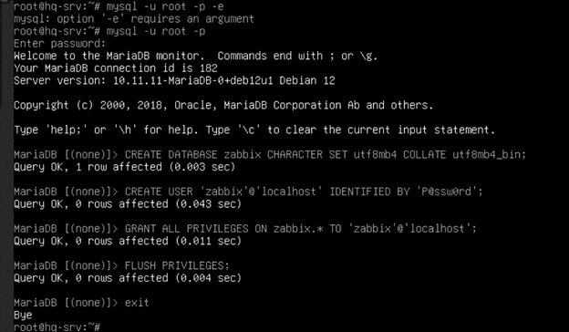

***zcat /usr/share/zabbix/sql-scripts/mysql/server.sql.gz | sudo mysql -u zabbix -p zabbix***

  

***sudo nano /etc/zabbix/zabbix_server.conf***

- Укажите:

***DBName=zabbix***  
***DBUser=zabbix***  
***DBPassword=P@ssw0rd***

  

- Запустите службу:

***sudo systemctl enable --now zabbix-server***

  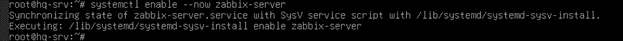

2. Настройка веб-интерфейса.

- Создайте символическую ссылку для доступа по нужному URL:

***ln -s /usr/share/zabbix /var/www/html/mon***

- Настройте PHP:

***sudo nano /etc/php/8.2/apache2/php.ini***

- Измените:
> чтобы быстро перемещаться по файлу ищем по строкам - ("CTRL" + "-")

***max_execution_time = 300***  /строка 409  
***max_input_time = 300***  /строка 419  
***post_max_size = 16M***  /строка 703  

  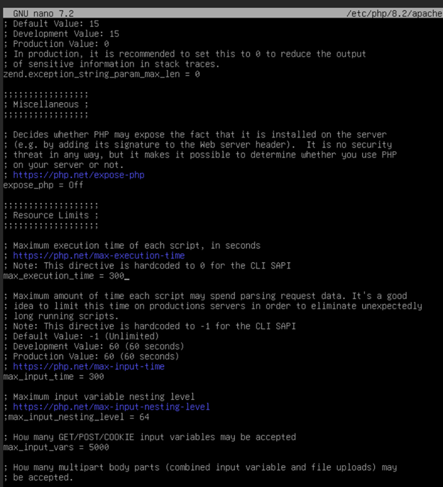

  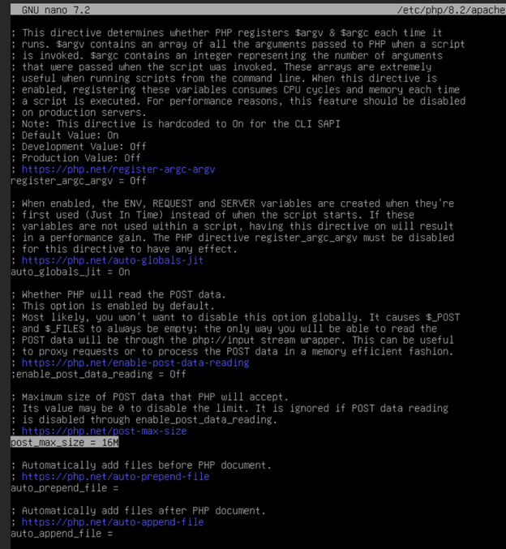

- Перезапустите Apache:

  

  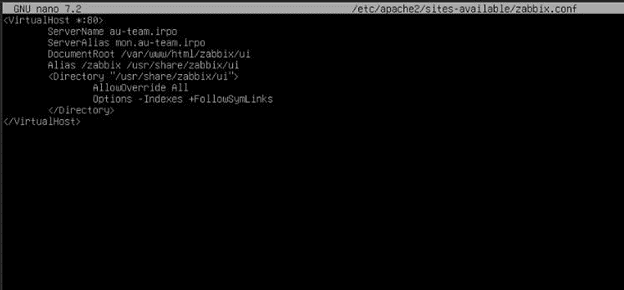

  

  

***sudo systemctl restart apache2***

3. Настроить DNS на HQ-SRV:

  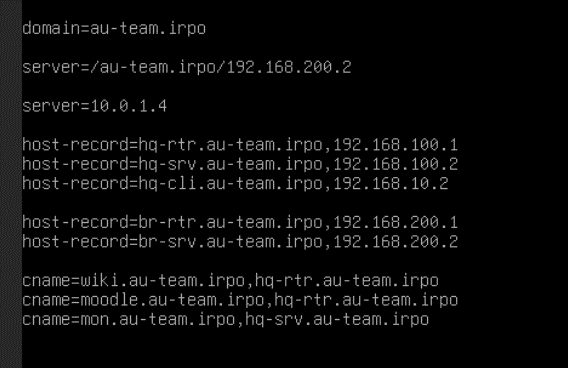

- Теперь интерфейс будет доступен по адресу:

***http://mon.au-team.irpo/zabbix***

  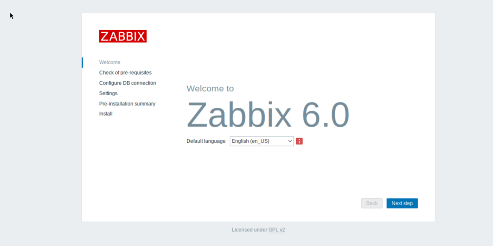

4. Настройка пользовательских учетных данных.

После установки войдите через браузер и авторизуйтесь с логином "Admin" и паролем "zabbix" по умолчанию. Эти данные можно изменить в интерфейсе Zabbix после входа — раздел "Administration → Users"

- ПАРОЛЬ - ЛОГИН ОТ ЗАБИКСА, Admin - zabbix. МЕНЯЕМ ПАРОЛЬ НА P@ssw0rd

  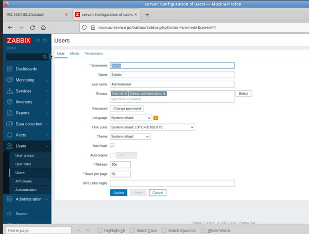

- Забикс агент
 
***wget https://repo.zabbix.com/zabbix/7.4/release/debian/pool/main/z/zabbix-release/zabbix-release_7.4-0.2%2Bdebian12_all.deb***

***sudo dpkg -i zabbix-release_7.4-0.2%2Bdebian12_all.deb***

***sudo apt update***

***apt install zabbix-agent***

- nano /etc/zabbix/zabbix_agentd.conf - там ищешь server serverActive пишешь ип сервера hqsrv типо, потом в hsotname ниже чуть чем serverActive пишешь хостнейм.

  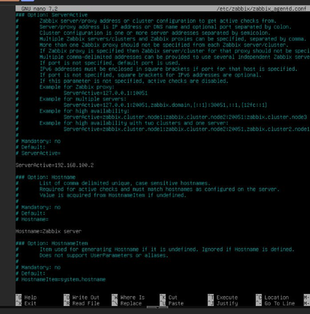

***systemctl restart zabbix-agent.service***

- Идешь в cli в веб версии по скрину что выше добовляешь сревер пишешь ип туда сюда и обезатЛЬНО !!!! прям срочно нужно в хост груп указать Linux server Linux By zubbix agent

  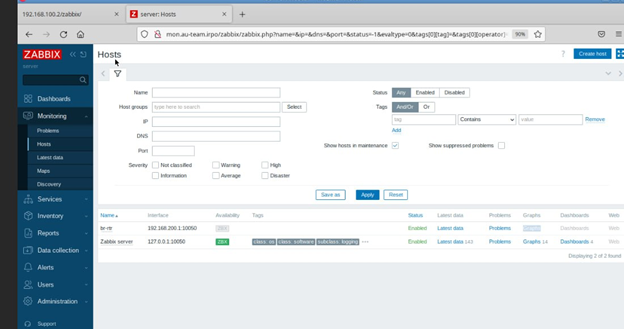

  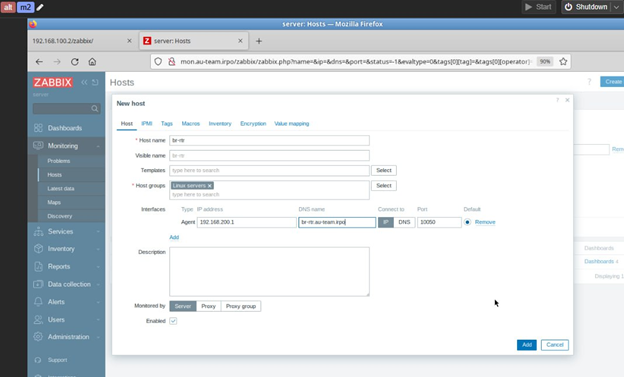

- Статистика дашборды

  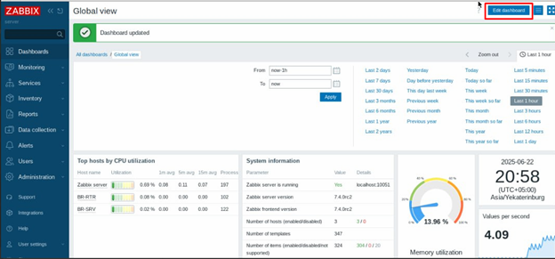

- Редачим:

  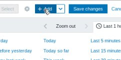

Адд виджит пикаем график:

  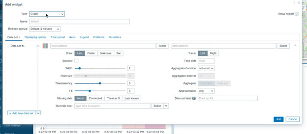

  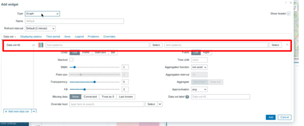

- Слева в инпуте выбираем сервера а с право выбираем параметры

  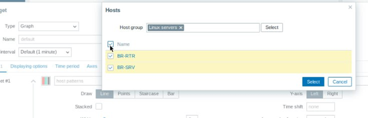

  

  

  

  

> Повезло если все робит

### 
<b>8.	Реализуйте механизм инвентаризации машин HQ-SRV и HQ-CLI через Ansible на BR-SRV</b>

1. Для начала необходимо создать каталог, в котором будут размещены отчеты о рабочих местах:

***mkdir /etc/ansible/PC_INFO***

  

2. Далее, создадим плейбук /etc/ansible/inventory.yml:

- Скачиваем его с github в необходимую директори:
> !dos2unix и curl на BR-SRV уже скачаны!

***curl -o /etc/ansible/inventory.yml https://raw.githubusercontent.com/4bobus/laba/refs/heads/main/files/inventory.yml***

***dos2unix /etc/ansible/inventory.yml***

- Потом проверяем его содержимое:

  

  

3. Проверим работу, командой:

***ansible-playbook /etc/ansible/inventory.yml***

  

> - Ansible помечает результат как changed, так как фактическое состояние системы меняется. При первом запуске плейбука это ожидаемое поведение.
> - Если запустить плейбук ещё раз, то Ansible покажет для тех же задач статус ok, потому что требуемое состояние уже достигнуто и ничего менять не нужно.

4. Проверим наличие и содержимое, созданных отчетов:

***ls -la /etc/ansible/PC_INFO***  
***cat /etc/ansible/PC_INFO/hq-cli.yml***  
***cat /etc/ansible/PC_INFO/hq-srv.yml***

  

> Как можно заметить, отчеты созданы и содержат необходимую информацию. Задание выполнено.

### 
<b>9.	Реализуйте механизм резервного копирования конфигурации для машин HQ-RTR и BR-RTR, через Ansible на BR-SRV</b>

1. Создадим также каталог, в котором будут размещены резервные копии конфигураций маршрутизаторов:

***mkdir /etc/ansible/NETWORK_INFO***

  

2. И создаём сам плейбук /etc/ansible/backup.yml:
> *ОБЯЗАТЕЛЬНО УСТАНОВИТЕ sudo НА HQ-RTR и BR-RTR*

- Скачаем файл с github в нужную директорию:
> !dos2unix и curl на BR-SRV уже скачаны!

***curl -o /etc/ansible/backup.yml https://raw.githubusercontent.com/4bobus/laba/refs/heads/main/files/backup.yml***

***dos2unix /etc/ansible/backup.yml***

- Проверяем его содержимое:

  

со следующим содержимым:

*ОБЯЗАТЕЛЬНО УСТАНОВИТЕ sudo НА HQ-RTR и BR-RTR*

  

3. Абсолютно также, как и в предыдущем задании, проверяем его работу, командой:

***ansible-playbook /etc/ansible/backup.yml***

  

> - Как и в прошлом задании, Ansible помечает результат как changed, так как фактическое состояние системы меняется. При первом запуске плейбука так и должно быть.
> - И если запустить его ещё раз, то Ansible покажет для тех же задач статус ok, потому что требуемое состояние уже достигнуто и ничего менять не нужно.

4. Проверим наличие созданных отчетов:

***ls -la /etc/ansible/NETWORK_INFO***  
***ls -la /etc/ansible/NETWORK_INFO/HQ-RTR***  
***ls -la /etc/ansible/NETWORK_INFO/BR-RTR***  

  

А также их содержимое, если хотите убедиться, что действительно скопировалось, для примера покажем файл interfaces с маршрутизатора HQ-RTR, остальные можете сами:

***cat /etc/ansible/NETWORK_INFO/HQ-RTR/interfaces***

  

> По итогу все резервные копии конфигураций созданы и содержат необходимую информацию. Задание выполнено.
